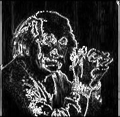
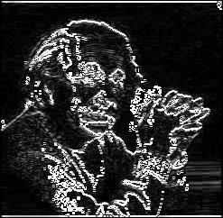
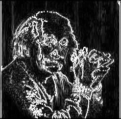

# Generalised approach for dealing with 3 by 3 kernels 

## Process

1. **`kernel-gen.v`**:
   - Reads two input text files:
     - `input_image.txt`: A text file representing the input image.
     - A kernel text file, which can be one of the following:
       - `prewitt_hor_kernel.txt`
       - `prewitt_ver_kernel.txt`
       - `sobel_hor_kernel.txt`
       - `sobel_ver_kernel.txt`
   - Applies the selected kernel to the input image matrix.
   - Produces output image files:
     - `output_image_prewitt_hor.jpg`
     - `output_image_prewitt_ver.jpg`
     - `output_image_sobel_hor.jpg`
     - `output_image_sobel_ver.jpg`

2. **`img2bin.py`**:
   - Converts an image file (`input_image.jpg`) into its text-based matrix representation (`input_image.txt`).

## Kernels

### Horizontal Prewitt Kernel
$$
\begin{bmatrix}
-1 & 0 & 1 \\
-1 & 0 & 1 \\
-1 & 0 & 1
\end{bmatrix}
$$

### Vertical Prewitt Kernel
$$
\begin{bmatrix}
1 & 1 & 1 \\
0 & 0 & 0 \\
-1 & -1 & -1
\end{bmatrix}
$$

### Horizontal Sobel Kernel
$$
\begin{bmatrix}
-1 & 0 & 1 \\
-2 & 0 & 2 \\
-1 & 0 & 1
\end{bmatrix}
$$

### Vertical Sobel Kernel
$$
\begin{bmatrix}
1 & 2 & 1 \\
0 & 0 & 0 \\
-1 & -2 & -1
\end{bmatrix}
$$

## Output Visualization

### Prewitt Masks
  

### Sobel Masks
  
