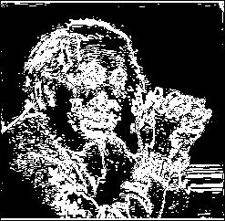
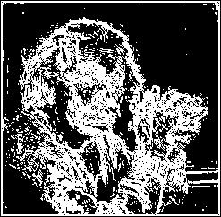
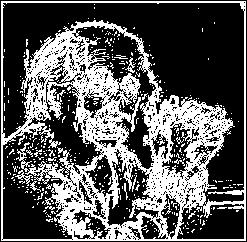
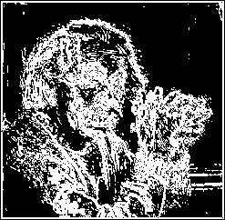

# Krisch Compass Edge Detection
The Krisch Compass is an edge detection technique that also uses eight compass directions (North, South, East, West, Northwest, Northeast, Southwest, Southeast) to detect edges in an image. This method is similar to the Robinson Compass, but it employs different kernels, designed to highlight edges in a more refined manner by detecting changes in pixel intensity across various orientations. The directionality of the kernels allows the detection of edges in all the compass directions, making it particularly effective for capturing edges in images where the orientation may vary.

## What is the Krisch Compass Edge Detection?
The Krisch Compass edge detection method is an extension of the concept of directional edge detection, which uses eight different kernels corresponding to compass directions to identify edges at multiple orientations. The key difference between the Krisch Compass and other edge detection methods (like the Sobel or Prewitt operators) is its use of eight directional kernels that highlight edges in a variety of orientations, giving it the ability to detect fine details and nuanced changes in the image's structure.

This method is useful when you want to detect edges in images where orientation and finer directional differences matter. It is commonly used in applications such as texture segmentation, pattern recognition, and when working with images that contain edges at various angles or in non-rectangular orientations.

By convolving each of these eight kernels with the image, the Krisch Compass can detect edge information from multiple directions. This allows for comprehensive edge detection, which can be particularly useful when analyzing images where edge directionality plays an important role in the final analysis.

## Mathematical Definition

### Kernels for the Kirsch Compass  

The Kirsch Compass operator uses eight directional kernels to detect edges in an image. These kernels are specifically designed to measure intensity changes in the directions: **North (N)**, **South (S)**, **East (E)**, **West (W)**, **Northwest (NW)**, **Northeast (NE)**, **Southwest (SW)**, and **Southeast (SE)**.  

The kernels are as follows:  

**North (N):**  

$$
G_N =  
\begin{bmatrix}  
-3 & -3 & 5 \\  
-3 & 0 & 5 \\  
-3 & -3 & 5  
\end{bmatrix}  
$$  

**South (S):**  

$$
G_S =  
\begin{bmatrix}  
-3 & -3 & -3 \\  
-3 & 0 & -3 \\  
5 & 5 & 5  
\end{bmatrix}  
$$  

**East (E):**  

$$
G_E =  
\begin{bmatrix}  
-3 & -3 & -3 \\  
-3 & 0 & 5 \\  
-3 & 5 & 5  
\end{bmatrix}  
$$  

**West (W):**  

$$
G_W =  
\begin{bmatrix}  
5 & 5 & -3 \\  
5 & 0 & -3 \\  
5 & -3 & -3  
\end{bmatrix}  
$$  

**Northwest (NW):**  

$$
G_{NW} =  
\begin{bmatrix}  
5 & 5 & 5 \\  
-3 & 0 & -3 \\  
-3 & -3 & -3  
\end{bmatrix}  
$$  

**Northeast (NE):**  

$$
G_{NE} =  
\begin{bmatrix}  
-3 & 5 & 5 \\  
-3 & 0 & 5 \\  
-3 & -3 & -3  
\end{bmatrix}  
$$  

**Southwest (SW):**  

$$
G_{SW} =  
\begin{bmatrix}  
-3 & -3 & -3 \\  
-3 & 0 & -3 \\  
5 & 5 & 5  
\end{bmatrix}  
$$  

**Southeast (SE):**  

$$
G_{SE} =  
\begin{bmatrix}  
-3 & -3 & -3 \\  
5 & 0 & -3 \\  
5 & 5 & 5  
\end{bmatrix}  
$$  

### Gradient Approximation  

For each kernel $$\( G_d \)$$ (where $$\( d \in \{N, S, E, W, NW, NE, SW, SE\} \)$$), the gradient at pixel $$\( (x, y) \)$$ is computed as:  

$$
(G_d * I)(x, y) = \sum_{i=-1}^{1} \sum_{j=-1}^{1} G_d(i, j) \cdot I(x+i, y+j)  
$$  

Here:  
- $$\( I(x, y) \)$$ is the image intensity at pixel $$\( (x, y) \)$$.  
- $$\( G_d(i, j) \)$$ is the value of the kernel at position $$\( (i, j) \)$$.  

### Combined Gradient Magnitude  

After convolving the image with all eight kernels, the magnitude of the edge gradient is computed as the maximum response across all directions:  

$$
G(x, y) = \max \left( \left| G_N \right|, \left| G_S \right|, \left| G_E \right|, \left| G_W \right|, \left| G_{NW} \right|, \left| G_{NE} \right|, \left| G_{SW} \right|, \left| G_{SE} \right| \right)  
$$  

Alternatively, the gradient magnitude can be calculated using the Euclidean norm:  

$$
G(x, y) = \sqrt{\sum_{d} \left( G_d(x, y) \right)^2}  
$$  

where $$\( d \)$$ iterates over all directions.  

---

## Process of Edge Detection  

### Step 1: Convolution  

Each kernel $$\( G_d \)$$ is convolved with the input image $$\( I(x, y) \)$$. The convolution operation is defined as:  

$$
(G_d * I)(x, y) = \sum_{i=-1}^{1} \sum_{j=-1}^{1} G_d(i, j) \cdot I(x+i, y+j)  
$$  

This results in eight gradient images, each corresponding to a specific directional kernel.  

### Step 2: Gradient Magnitude Calculation  

The gradient magnitude is calculated either as the maximum response among all directional gradients:  

$$
G(x, y) = \max \left( \left| G_N \right|, \left| G_S \right|, \left| G_E \right|, \left| G_W \right|, \left| G_{NW} \right|, \left| G_{NE} \right|, \left| G_{SW} \right|, \left| G_{SE} \right| \right)  
$$  

Or as the sum of the squared responses:  

$$
G(x, y) = \sqrt{\sum_{d} \left( G_d(x, y) \right)^2}  
$$  

### Step 3: Thresholding  

Thresholding is applied to the gradient magnitude to create a binary edge map. A pixel is considered an edge if its gradient magnitude exceeds a certain threshold $$\( T \)$$:  

$$
E(x, y) =  
\begin{cases}  
1, & \text{if } G(x, y) \geq T \\  
0, & \text{otherwise}  
\end{cases}  
$$  

---

## Implementation Details  

### Fixed Threshold  

In this approach, the edge magnitude is thresholded with a fixed value to detect significant edges.  

**Code Files:**  
- **kirsch.v**: Verilog code implementing convolution and fixed thresholding.  
- **Output Files:**  
  - `output_image_kirsch.jpg`: Image showing edges detected using Kirsch Compass.  
  - `output_image_kirsch.txt`: Binary output data of detected edges.  

### Dynamic Normalization  

Dynamic normalization adjusts the edge magnitude by scaling it to a range of 0–255 based on the maximum gradient magnitude in the image.  

**Normalization Formula:**  

$$
G_{\text{norm}}(x, y) = \frac{G(x, y)}{\max(G(x, y))} \times 255  
$$  

**Code Files:**  
- **kirsch-dynamic.v**: Verilog code implementing convolution and dynamic normalization.  
- **Output Files:**  
  - `output_image_kirsch_dynamic.jpg`: Dynamically normalized edge-detected image.  
  - `output_image_kirsch_dynamic.txt`: Normalized binary data of edges.  

---

### Output Files

For each direction, we generate the following files:

1. **Image Files**: The output images for each direction after applying the Krisch compass kernels:
   - `output_image_X_kc.jpg` where X represents the direction (n, s, e, w, nw, ne, se, sw).

2. **Text Files**: The binary data for each processed image:
   - `output_image_X_kc.txt`, which contains the raw binary data.

For each direction, the image and text files will be saved:

- `output_image_n_kc.jpg`
- `output_image_s_kc.jpg`
- `output_image_e_kc.jpg`
- `output_image_w_kc.jpg`
- `output_image_nw_kc.jpg`
- `output_image_ne_kc.jpg`
- `output_image_sw_kc.jpg`
- `output_image_se_kc.jpg`

---

### Example Execution for One Direction (e.g., East)

1. **Convolution**: The East kernel (E) is applied to the image, resulting in edge detection for that direction.

2. **Thresholding**: The image is thresholded at 127 to produce a binary edge map.

3. **Output**: The resulting binary image is saved as `output_image_e_kc.jpg`, and the binary values are saved in `output_image_e_kc.txt`.

---

### Visual Output

The results of applying the Krisch compass kernels to the image are shown below. Each kernel highlights edges in a specific direction:

- **East Direction (E)**:

 

- **South Direction (S)**:

 

- **West Direction (W)**:

 

- **North Direction (N)**:

 

- **Northwest Direction (NW)**:

 

- **Northeast Direction (NE)**:

 

- **Southwest Direction (SW)**:

 

- **Southeast Direction (SE)**:

 

---

### Binary Edge Detection (Threshold 127)

Additionally, the binary edge maps for each direction, after applying the 127 threshold to the gradient magnitudes, are provided. The file paths for each direction are as follows:

- **East Direction**: `output_image_e_kc.jpg`  
- **South Direction**: `output_image_s_kc.jpg`  
- **West Direction**: `output_image_w_kc.jpg`  
- **North Direction**: `output_image_n_kc.jpg`  
- **Northwest Direction**: `output_image_nw_kc.jpg`  
- **Northeast Direction**: `output_image_ne_kc.jpg`  
- **Southwest Direction**: `output_image_sw_kc.jpg`  
- **Southeast Direction**: `output_image_se_kc.jpg`

---

This implementation uses **Icarus Verilog 12.0** for hardware description and **Python 3.12.1** for image processing and visualization. The Verilog code performs the convolution of the Krisch compass kernels with the input image and calculates the edge strengths. Python handles the conversion between image formats, binary data handling, and visualization of the results.

### Execution Steps

1. **Convert Image to Binary** (img2bin.py)
2. **Apply Krisch Compass Kernels** using Verilog
3. **Thresholding and Magnitude Calculation** 
4. **Convert Binary Outputs to Images** (bin2img.py)
