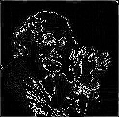
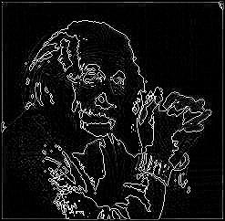
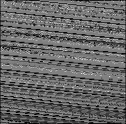
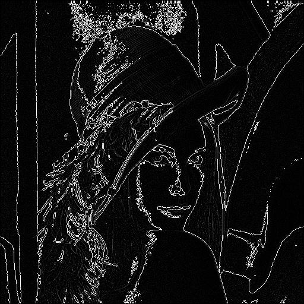

# Laplacian Operator in Edge Detection
The Laplacian operator is a second-order derivative operator used in edge detection to highlight regions of rapid intensity change. Unlike first-order operators such as Sobel and Prewitt, which calculate gradients, the Laplacian operator measures the rate of change of gradients (second derivatives). It is particularly effective for detecting edges and transitions in intensity, capturing edges regardless of direction.

## What is the Laplacian Operator?
The Laplacian operator is a mathematical tool that calculates the second derivative of an image to identify areas where the intensity changes abruptly. Edges are detected by locating zero crossings in the Laplacian result, which correspond to significant transitions in intensity. This operator is isotropic, meaning it responds equally to edges in all directions.

The Laplacian operator is widely used in applications such as image sharpening, noise detection, and feature extraction in computer vision and image processing tasks. It is often combined with smoothing techniques like Gaussian filtering to reduce noise and produce more accurate results.

## Mathematical Definition

The Laplacian operator uses a kernel to calculate the second derivative of the image intensity, providing a measure of the curvature of the intensity function at each pixel. The Laplacian masks are defined as follows:

### Positive Mask:

The positive Laplacian mask highlights regions of rapid intensity change in a positive direction (bright areas).

$$
\text{Positive Mask} = 
\begin{bmatrix}
0 & 1 & 0 \\
1 & -4 & 1 \\
0 & 1 & 0
\end{bmatrix}
$$

### Negative Mask:

The negative Laplacian mask highlights regions of rapid intensity change in a negative direction (dark areas).

$$
\text{Negative Mask} = 
\begin{bmatrix}
0 & -1 & 0 \\
-1 & 4 & -1 \\
0 & -1 & 0
\end{bmatrix}
$$

Where:
- The positive mask detects edges by emphasizing the bright regions in the image.
- The negative mask detects edges by highlighting dark regions.

## Process of Edge Detection

1. **Apply Convolution**: The Laplacian operator is applied by convolving the image with the positive or negative masks. For each pixel in the image, the neighborhood around it is multiplied by the kernel, and the results are summed up, resulting in the edge-detected image.

2. **Thresholding**: To identify significant edges, the resulting image may be thresholded. Pixels with values above a certain threshold are considered part of the edge, while others are discarded.

---

## Implementation

This implementation uses **Python 3.12.1** for image processing and visualization.

- The Python code performs the convolution of the Laplacian masks with the input image and generates the output images.
- The input image is processed using both the positive and negative Laplacian masks.

### Code Flow

The following steps describe the process:

1. **img2bin.py** – Converts the input image (in `.jpg` format) into a binary `.txt` format for further processing. The input image should already be in black-and-white (BW); if not, it must be converted beforehand.
   - **Input**: `input_image.jpg`
   - **Output**: `input_image.txt`

2. **laplacian-pos.v** – Implements the positive Laplacian operator. This Verilog file reads the binary image and applies the positive Laplacian mask.
   - **Input**: `input_image.txt`
   - **Output**: `output_image_pos_lp.txt`

3. **laplacian-neg.v** – Implements the negative Laplacian operator. This Verilog file reads the binary image and applies the negative Laplacian mask.
   - **Input**: `input_image.txt`
   - **Output**: `output_image_neg_lp.txt`

4. **bin2img.py** – Converts the binary `.txt` files (output from the Verilog simulations) back into `.jpg` images.
   - **bin2img.py** – Converts `output_image_pos_lp.txt` to `output_image_pos_lp.jpg`.
   - **bin2img.py** – Converts `output_image_neg_lp.txt` to `output_image_neg_lp.jpg`.

### Execution Steps

The following steps are executed in sequence to complete the edge detection process:

1. **Convert Image to Binary (img2bin.py)**

   ```bash
   python .\img2bin.py
   ```

   Converts the input image (`input_image.jpg`) to the binary file format (`input_image.txt`).

2. **Positive Laplacian Operation (laplacian-pos.v)**

   ```bash
   iverilog -o laplacian-pos .\laplacian-pos.v
   vvp .\laplacian-pos
   ```

   The Verilog code (`laplacian-pos.v`) is compiled using `iverilog` to create the executable `laplacian-pos`. The `vvp` command generates `output_image_pos_lp.txt`.

3. **Negative Laplacian Operation (laplacian-neg.v)**

   ```bash
   iverilog -o laplacian-neg .\laplacian-neg.v
   vvp .\laplacian-neg
   ```

   The Verilog code (`laplacian-neg.v`) is compiled to create the executable `laplacian-neg`. The `vvp` command generates `output_image_neg_lp.txt`.

4. **Convert Binary Outputs to Images**

   ```bash
   python .\bin2img.py
   ```

   Converts `output_image_pos_lp.txt` and `output_image_neg_lp.txt` to `.jpg` images.

---

### Positive Laplacian Edge Detection
The following images show the input image and the output image after applying the positive Laplacian mask.

 

### Negative Laplacian Edge Detection
The following images show the input image and the output image after applying the negative Laplacian mask.

 

### Example Images

The following table shows the results of the positive and negative Laplacian operations on separate images.

<table>
  <tr>
    <td><b>Original Image</b></td>
   <td><b>Positive Laplacian</b></td>
   <td><b>Negative Laplacian</b></td>
  </tr>
  <tr>
    <td></td>
   <td></td>
   <td></td>
  </tr>
</table>

### Conclusion

This implementation uses the Laplacian operator for edge detection. The process involves applying the positive and negative Laplacian masks, which highlight bright and dark regions of rapid intensity change, respectively. The results show the effectiveness of the Laplacian operator in detecting edges.

---

This implementation utilizes the following tools:

- **Icarus Verilog 12.0** for hardware description and simulation. This tool is used to compile the Verilog code for the Laplacian operator and perform edge detection in hardware simulation.
- **Python 3.12.1** for image processing and visualization. Python handles the conversion between image formats, binary data handling, and applies the edge detection processing to visualize the results.
