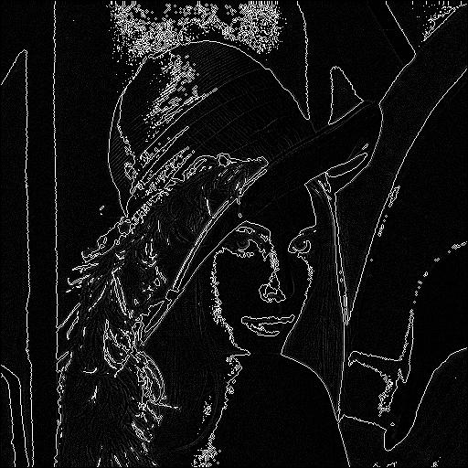

# Laplacian Operator in Edge Detection
The Laplacian operator is a second-order derivative operator used in edge detection to highlight regions of rapid intensity change. Unlike first-order operators such as Sobel and Prewitt, which calculate gradients, the Laplacian operator measures the rate of change of gradients (second derivatives). It is particularly effective for detecting edges and transitions in intensity, capturing edges regardless of direction.

## What is the Laplacian Operator?
The Laplacian operator is a mathematical tool that calculates the second derivative of an image to identify areas where the intensity changes abruptly. Edges are detected by locating zero crossings in the Laplacian result, which correspond to significant transitions in intensity. This operator is isotropic, meaning it responds equally to edges in all directions.

The Laplacian operator is widely used in applications such as image sharpening, noise detection, and feature extraction in computer vision and image processing tasks. It is often combined with smoothing techniques like Gaussian filtering to reduce noise and produce more accurate results.


## Mathematical Definition  

### Gradient and Second Derivatives  

The **Laplacian operator** is a second-order derivative operator that measures the rate at which the gradient of an image changes. It calculates the sum of the second derivatives in both the horizontal and vertical directions:  

$$
\nabla^2 I(x, y) = \frac{\partial^2 I(x, y)}{\partial x^2} + \frac{\partial^2 I(x, y)}{\partial y^2}  
$$  

Let $$\( I(x, y) \)$$ represent the intensity of a pixel at position $$\( (x, y) \)$$. The discrete approximation of the Laplacian operator can be represented as a convolution of the image with a predefined kernel.  

### Discrete Laplacian Masks  

The Laplacian operator employs kernels to approximate the second derivatives in discrete space. Two common kernels, the **positive Laplacian mask** and the **negative Laplacian mask**, are defined as follows:  

#### Positive Laplacian Mask  

$$
L_{+} = \begin{bmatrix}  
0 & 1 & 0 \\  
1 & -4 & 1 \\  
0 & 1 & 0  
\end{bmatrix}  
$$  

#### Negative Laplacian Mask  

$$
L_{-} = \begin{bmatrix}  
0 & -1 & 0 \\  
-1 & 4 & -1 \\  
0 & -1 & 0  
\end{bmatrix}  
$$  

These masks can also take diagonal neighbors into account, resulting in larger masks like:  

#### Extended Laplacian Mask  

$$
L_{ext} = \begin{bmatrix}  
1 & 1 & 1 \\  
1 & -8 & 1 \\  
1 & 1 & 1  
\end{bmatrix}  
$$  

In general, the choice of mask determines whether the operator highlights bright regions ($$\( L_+ \)$$) or dark regions ($$\( L_- \)$$) of the image.  

---

### Discrete Formulation  

For a pixel located at $$\( (x, y) \)$$, the Laplacian operator can be approximated using the convolution formula:  

$$
\nabla^2 I(x, y) \approx \sum_{i=-1}^{1} \sum_{j=-1}^{1} L(i, j) \cdot I(x+i, y+j)  
$$  

Where $$\( L(i, j) \)$$ represents the kernel values and $$\( I(x+i, y+j) \)$$ represents the pixel intensities in the neighborhood of $$\( (x, y) \)$$.  

---

## Process of Edge Detection  

The Laplacian operator emphasizes regions of rapid intensity change, making it useful for detecting edges. The process involves the following steps:  

### 1. Apply Convolution  

The image $$\( I(x, y) \)$$ is convolved with the Laplacian mask $$\( L(i, j) \)$$:  

$$
I_{lap}(x, y) = \sum_{i=-1}^{1} \sum_{j=-1}^{1} L(i, j) \cdot I(x+i, y+j)  
$$  

This results in an image $$\( I_{lap}(x, y) \)$$, where edges correspond to regions of high positive or negative values.  

---

### 2. Zero-Crossing Detection  

Edges can also be detected by identifying **zero-crossings** in $$\( I_{lap}(x, y) \)$$. These are points where the Laplacian value changes sign, indicating a transition from a region of high curvature to a flat region. Mathematically:  

$$
\text{Zero-Crossing at } (x, y): \nabla^2 I(x, y) \cdot \nabla^2 I(x', y') < 0  
$$  

Where $$\( (x', y') \)$$ are neighboring pixels of $$\( (x, y) \)$$.  

---

### 3. Thresholding  

To isolate significant edges, the Laplacian output can be thresholded:  

$$
E(x, y) =  
\begin{cases}  
1, & \text{if } |I_{lap}(x, y)| \geq T \\  
0, & \text{otherwise}  
\end{cases}  
$$  

Where $$\( T \)$$ is a user-defined threshold.  

---

### Dynamic Normalization  

To scale the Laplacian values to a standard range, dynamic normalization is applied. Each pixel value is scaled based on the maximum absolute Laplacian value in the image:  

$$
I_{norm}(x, y) = \frac{I_{lap}(x, y)}{\max(|I_{lap}|)} \times 255  
$$  

This ensures that the output is in the range $$\( [0, 255] \)$$.  

---

## Variants and Use Cases  

### Combined Laplacian Edge Detection  

By combining positive and negative masks, the Laplacian operator can detect both bright-to-dark and dark-to-bright transitions. The combined result is:  

$$
I_{combined}(x, y) = |(L_{+} * I)(x, y)| + |(L_{-} * I)(x, y)|  
$$  

### Laplacian of Gaussian (LoG)  

To improve noise sensitivity, the Laplacian operator is often combined with a Gaussian smoothing filter. The LoG is defined as:  

$$
LoG(x, y) = \nabla^2 (G(x, y) * I(x, y))  
$$  

Where $$\( G(x, y) \)$$ is a Gaussian kernel.  

The combined operation can be written as a single convolution with a LoG kernel:  

$$
LoG(x, y) = \sum_{i=-k}^{k} \sum_{j=-k}^{k} LoG(i, j) \cdot I(x+i, y+j)  
$$  

---

## Code Implementation  

**Code Files:**  
1. **laplacian.v**: Implements convolution with the Laplacian kernel and applies thresholding.  
2. **laplacian-dynamic.v**: Includes normalization to scale edge strengths.  

**Output Files:**  
- `output_image_laplacian.jpg`: Edge-detected image using the Laplacian operator.  
- `output_image_laplacian_dynamic.jpg`: Image with dynamically normalized edge strengths.  
- `output_image_laplacian.txt`: Raw binary data of the processed image.  


---

### Code Flow

The following steps describe the process:

1. **img2bin.py** – Converts the input image (in `.jpg` format) into a binary `.txt` format for further processing. The input image should already be in black-and-white (BW); if not, it must be converted beforehand.
   - **Input**: `input_image.jpg`
   - **Output**: `input_image.txt`

2. **laplacian-pos.v** – Implements the positive Laplacian operator. This Verilog file reads the binary image and applies the positive Laplacian mask.
   - **Input**: `input_image.txt`
   - **Output**: `output_image_pos_lp.txt`

3. **laplacian-neg.v** – Implements the negative Laplacian operator. This Verilog file reads the binary image and applies the negative Laplacian mask.
   - **Input**: `input_image.txt`
   - **Output**: `output_image_neg_lp.txt`

4. **bin2img.py** – Converts the binary `.txt` files (output from the Verilog simulations) back into `.jpg` images.
   - **bin2img.py** – Converts `output_image_pos_lp.txt` to `output_image_pos_lp.jpg`.
   - **bin2img.py** – Converts `output_image_neg_lp.txt` to `output_image_neg_lp.jpg`.

### Execution Steps

The following steps are executed in sequence to complete the edge detection process:

1. **Convert Image to Binary (img2bin.py)**

   ```bash
   python .\img2bin.py
   ```

   Converts the input image (`input_image.jpg`) to the binary file format (`input_image.txt`).

2. **Positive Laplacian Operation (laplacian-pos.v)**

   ```bash
   iverilog -o laplacian-pos .\laplacian-pos.v
   vvp .\laplacian-pos
   ```

   The Verilog code (`laplacian-pos.v`) is compiled using `iverilog` to create the executable `laplacian-pos`. The `vvp` command generates `output_image_pos_lp.txt`.

3. **Negative Laplacian Operation (laplacian-neg.v)**

   ```bash
   iverilog -o laplacian-neg .\laplacian-neg.v
   vvp .\laplacian-neg
   ```

   The Verilog code (`laplacian-neg.v`) is compiled to create the executable `laplacian-neg`. The `vvp` command generates `output_image_neg_lp.txt`.

4. **Convert Binary Outputs to Images**

   ```bash
   python .\bin2img.py
   ```

   Converts `output_image_pos_lp.txt` and `output_image_neg_lp.txt` to `.jpg` images.

---

### Positive Laplacian Edge Detection
The following images show the input image and the output image after applying the positive Laplacian mask.

 

### Negative Laplacian Edge Detection
The following images show the input image and the output image after applying the negative Laplacian mask.

 

### Example Images

The following table shows the results of the positive and negative Laplacian operations on separate images.

<table>
  <tr>
    <td><b>Original Image</b></td>
   <td><b>Positive Laplacian</b></td>
   <td><b>Negative Laplacian</b></td>
  </tr>
  <tr>
    <td></td>
   <td></td>
   <td></td>
  </tr>
</table>

### Conclusion

This implementation uses the Laplacian operator for edge detection. The process involves applying the positive and negative Laplacian masks, which highlight bright and dark regions of rapid intensity change, respectively. The results show the effectiveness of the Laplacian operator in detecting edges.

---

## Implementation

This implementation is done using **Icarus Verilog 12.0** for the hardware description and **Python 3.12.1** for the image processing and visualization. 

**Icarus Verilog 12.0** for hardware description and simulation. This tool is used to compile the Verilog code for the Prewitt operator and perform edge detection in hardware simulation.

**Python 3.12.1** for image processing and visualization. Python handles the conversion between image formats, binary data handling, and applies the edge detection processing to visualize the results.
