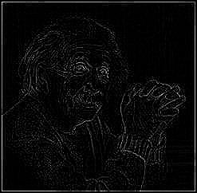
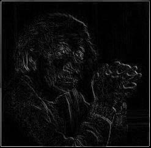

# Edge Detection with Laplacian Operator

| **Original**              | **Output Image (Positive Operator)** | **Output Image (Negative Operator)** | 
|---------------------------|--------------------------------------|--------------------------------------|
|  |  |  | 
