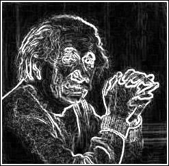
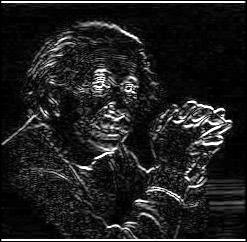
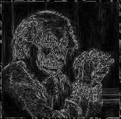
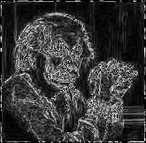
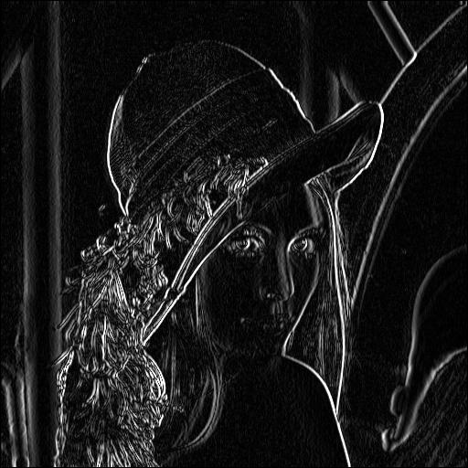
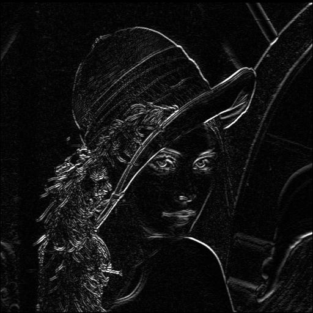
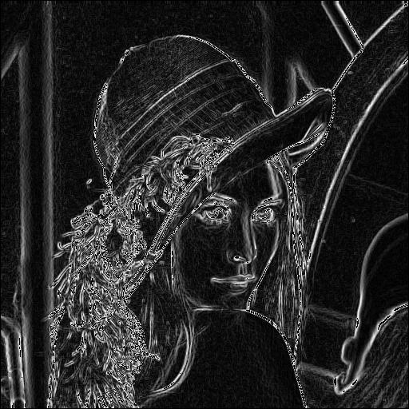
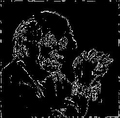

# Prewitt Operator in Edge Detection

The Prewitt operator is a discrete differentiation operator used in edge detection. It is based on convolving an image with a pair of kernels (masks) to compute the gradient in the horizontal and vertical directions. These gradients provide information about the rate of change in intensity at each pixel, which helps in detecting edges.

## What is the Prewitt Operator?

The Prewitt operator is a gradient-based technique that calculates the rate of intensity change in an image. Edges represent areas with significant intensity changes, and by finding the gradient at each pixel, the operator highlights these edges. The primary purpose is to simplify the image data for applications like object recognition, feature extraction, and image segmentation.

Unlike more complex edge detectors, the Prewitt operator uses fixed convolution masks, making it computationally efficient and easy to implement. It is particularly effective for applications requiring a fast and straightforward edge-detection method.


## Mathematical Definition  

### Gradient Masks  

The **Prewitt operator** is mathematically defined as a discrete approximation to the partial derivatives of an image $$\( I(x, y) \)$$. It employs two convolution kernels, $$\( G_x \)$$ for the horizontal gradient and $$\( G_y \)$$ for the vertical gradient. These are represented as:  

For the vertical gradient $$\( G_y \)$$:  

$$
G_y = \begin{bmatrix}  
-1 & 0 & 1 \\  
-1 & 0 & 1 \\  
-1 & 0 & 1  
\end{bmatrix}  
$$  

For the horizontal gradient $$\( G_x \)$$:  

$$
G_x = \begin{bmatrix}  
-1 & -1 & -1 \\  
0 & 0 & 0 \\  
1 & 1 & 1  
\end{bmatrix}  
$$  

### Discrete Gradient Approximation  

Let $$\( I(x, y) \)$$ represent the image intensity at pixel coordinates $$\( (x, y) \)$$. The discrete approximations to the partial derivatives are computed as: 

$$
\partial_x I(x, y) \approx \sum_{i=-1}^{1} \sum_{j=-1}^{1} G_x(i, j) \cdot I(x+i, y+j)  
$$  


$$
\partial_y I(x, y) \approx \sum_{i=-1}^{1} \sum_{j=-1}^{1} G_y(i, j) \cdot I(x+i, y+j)  
$$  

Using a general summation over the image domain:

$$
(G_x * I)(x, y) = \sum_{m=1}^{M} \sum_{n=1}^{N} G_x(m, n) \cdot I(x+m-2, y+n-2)  
$$  

$$
(G_y * I)(x, y) = \sum_{m=1}^{M} \sum_{n=1}^{N} G_y(m, n) \cdot I(x+m-2, y+n-2)  
$$  

where $$\( M \)$$ and $$\( N \)$$ are the dimensions of the kernels.  

### Gradient Magnitude  

The magnitude of the gradient at a pixel is computed as:  

$$
G(x, y) = \sqrt{\left(\partial_x I(x, y)\right)^2 + \left(\partial_y I(x, y)\right)^2}  
$$  

For computational efficiency, the gradient magnitude is often approximated as: 

$$
G(x, y) \approx |\partial_x I(x, y)| + |\partial_y I(x, y)|  
$$  

### Gradient Direction  

The direction of the gradient is given by:  

$$
\theta(x, y) = \tan^{-1}\left(\frac{\partial_y I(x, y)}{\partial_x I(x, y)}\right)  
$$  

---

## Process of Edge Detection  

### Convolution  

The edge detection process begins by convolving the image $$\( I(x, y) \)$$ with the Prewitt kernels $$\( G_x \)$$ and $$\( G_y \)$$. Mathematically, this operation for each pixel $$\( (x, y) \)$$ is expressed as:  

Horizontal gradient:  

$$
(G_x * I)(x, y) = \sum_{i=-1}^{1} \sum_{j=-1}^{1} G_x(i, j) \cdot I(x+i, y+j)  
$$  

Vertical gradient:

$$
(G_y * I)(x, y) = \sum_{i=-1}^{1} \sum_{j=-1}^{1} G_y(i, j) \cdot I(x+i, y+j)  
$$  

### Gradient Magnitude and Direction  

The gradients computed using the convolution operation are combined to form the gradient magnitude and direction. The magnitude at each pixel is: 

$$
G(x, y) = \sqrt{\left(\sum_{i=-1}^{1} \sum_{j=-1}^{1} G_x(i, j) \cdot I(x+i, y+j)\right)^2 + \left(\sum_{i=-1}^{1} \sum_{j=-1}^{1} G_y(i, j) \cdot I(x+i, y+j)\right)^2}  
$$  

The direction is similarly computed as:  

$$
\theta(x, y) = \tan^{-1}\left(\frac{\sum_{i=-1}^{1} \sum_{j=-1}^{1} G_y(i, j) \cdot I(x+i, y+j)}{\sum_{i=-1}^{1} \sum_{j=-1}^{1} G_x(i, j) \cdot I(x+i, y+j)}\right)  
$$  

### Thresholding  

Edges are identified by applying a threshold $$\( T \)$$ to the gradient magnitude. This is expressed as:  

$$
E(x, y) =  
\begin{cases}  
1, & \text{if } G(x, y) \geq T \\  
0, & \text{otherwise}  
\end{cases}  
$$  

### Continuous Interpretation  

The Prewitt operator approximates the partial derivatives of $$\( I(x, y) \)$$:  

$$
\partial_x I(x, y) \approx \frac{I(x+1, y) - I(x-1, y)}{2}  
$$  

$$
\partial_y I(x, y) \approx \frac{I(x, y+1) - I(x, y-1)}{2}  
$$  

This corresponds to the central difference method in numerical differentiation.  


---

### Combined Prewitt Operator (Fixed Threshold)

In this approach, we combine the magnitudes from both the vertical and horizontal gradients to determine the edge strength at each pixel. The combined edge strength is then truncated to a maximum value of 255 (fixed-point threshold). This ensures that any values above 255 are capped.

1. **Magnitude Calculation**: The combined magnitude is calculated as:

$$
Edge_{strength} = \sqrt{G_x^2 + G_y^2}
$$

2. **Truncation**: If the calculated edge strength exceeds 255, it is set to 255.

3. **Output**: The final image is generated using the truncated edge strengths.

**Code Files:**
- **prewitt.v**: This Verilog code calculates the combined edge strength and truncates values above 255.
- **Output Files**: 
  - `output_image_combined.jpg`: This is the resulting image after applying the combined Prewitt operator and thresholding.
  - `output_image_combined.txt`: The raw binary data of the processed image.

---

### Dynamic Normalization

In this process, we normalize the edge strength by dividing each pixel’s edge strength by the maximum edge strength in the image and then scaling it to fit within the range of 0 to 255. This ensures that the maximum edge strength is 255.

1. **Edge Strength Normalization**: 

$$
Edge_{norm} = \frac{Edge_{strength}}{Max_{value}} \times 255
$$

2. **Output**: The final image is generated after normalizing the edge strengths.

**Code Files:**
- **prewitt-dynamic.v**: This Verilog code calculates the edge strengths and applies dynamic normalization.
- **Output Files**:
  - `output_image_combined_dynamic.jpg`: The resulting image after applying dynamic normalization.
  - `output_image_combined_dynamic.txt`: The raw binary data of the normalized image.


---

### Code Flow

The following is a step-by-step breakdown of the process using different code files:

1. **img2bin.py** – Converts the input image (in `.jpg` format) into a binary `.txt` format for further processing. The input image should already be in black-and-white (BW); if not, it must be converted beforehand.
   - **Input**: `input_image.jpg`
   - **Output**: `input_image.txt`

2. **prewitt-ver.v** – Implements the vertical Prewitt operator. This Verilog file reads the binary image and applies the vertical Prewitt mask.
   - **Input**: `input_image.txt`
   - **Output**: `output_image_ver.txt`

3. **prewitt-hor.v** – Implements the horizontal Prewitt operator. This Verilog file reads the binary image and applies the horizontal Prewitt mask.
   - **Input**: `input_image.txt`
   - **Output**: `output_image_hor.txt`

4. **prewitt.v** – Implements the combined Prewitt operator, where the edge strength is calculated and truncated to 255.
   - **Input**: `input_image.txt`
   - **Output**: `output_image_combined.txt`

5. **prewitt-dynamic.v** – Implements the dynamic normalization of edge strength.
   - **Input**: `input_image.txt`
   - **Output**: `output_image_combined_dynamic.txt`

6. **bin2img.py** – Converts the binary `.txt` files (output from the Verilog simulations) back into `.jpg` images.
   - **bin2img.py** – Converts `output_image_combined.txt` to `output_image_combined.jpg`.
   - **bin2img.py** – Converts `output_image_combined_dynamic.txt` to `output_image_combined_dynamic.jpg`.

### Execution Steps

The following steps are executed in sequence to complete the edge detection process:

1. **Convert Image to Binary (img2bin.py)**

   ```bash
   python .\img2bin.py
   ```

   Converts the input image (`input_image.jpg`) to the binary file format (`input_image.txt`).

2. **Vertical Prewitt Operation (prewitt-ver.v)**

   ```bash
   iverilog -o prewitt-v .\prewitt-ver.v
   vvp .\prewitt-v
   ```

   The Verilog code (`prewitt-ver.v`) is compiled using `iverilog` to create the executable `prewitt-v`. The `vvp` command runs the simulation, generating `output_image_ver.txt`.

3. **Horizontal Prewitt Operation (prewitt-hor.v)**

   ```bash
   iverilog -o prewitt-h .\prewitt-hor.v
   vvp .\prewitt-h
   ```

   The Verilog code (`prewitt-hor.v`) is compiled to create the executable `prewitt-h`. The `vvp` command generates `output_image_hor.txt`.

4. **Combined Prewitt (prewitt.v)**

   ```bash
   iverilog -o prewitt .\prewitt.v
   vvp .\prewitt
   ```

   This Verilog code applies the combined Prewitt operator and generates `output_image_combined.txt`.

5. **Dynamic Normalization (prewitt-dynamic.v)**

   ```bash
   iverilog -o prewitt-dynamic .\prewitt-dynamic.v
   vvp .\prewitt-dynamic
   ```

   This Verilog code applies dynamic normalization and generates `output_image_combined_dynamic.txt`.

6. **Convert Binary Outputs to Images**

   ```bash
   python .\bin2img.py
   ```

   Converts `output_image_combined.txt` and `output_image_combined_dynamic.txt` to `.jpg` images.

---

### Vertical Gradient Detection
The following images show the input image and the output image after applying the vertical Prewitt mask.

 

### Horizontal Gradient Detection
The following images show the input image and the output image after applying the horizontal Prewitt mask.

 

### Combined Prewitt Edge Detection (Fixed Threshold)
The following image shows the input image and the output image after applying the combined Prewitt operator with fixed threshold truncation.

 

### Dynamic Normalization of Edge Detection
The following image shows the input image and the output image after applying dynamic normalization to the combined Prewitt operator.

 

<table>
  <tr>
    <td><b>Original Image</b></td>
   <td><b>Prewitt Vertical</b></td>
   <td><b>Prewitt Horizontal</b></td>
    <td><b>Dynamic Normalized Image</b></td>
  </tr>
  <tr>
    <td></td>
   <td></td>
   <td></td>
    <td></td>
  </tr>
</table>


### Binary Image with 127 Threshold

 


---

## Implementation

This implementation is done using **Icarus Verilog 12.0** for the hardware description and **Python 3.12.1** for the image processing and visualization. 

**Icarus Verilog 12.0** for hardware description and simulation. This tool is used to compile the Verilog code for the Prewitt operator and perform edge detection in hardware simulation.

**Python 3.12.1** for image processing and visualization. Python handles the conversion between image formats, binary data handling, and applies the edge detection processing to visualize the results.
