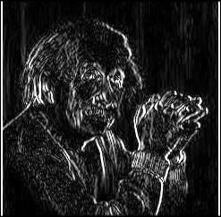

# Prewitt Operator in Edge Detection

The Prewitt operator is a discrete differentiation operator used in edge detection. It is based on convolving an image with a pair of kernels (masks) to compute the gradient in the horizontal and vertical directions. These gradients provide information about the rate of change in intensity at each pixel, which helps in detecting edges.

## Mathematical Definition

The Prewitt operator uses two kernels to approximate the gradient of an image in the horizontal and vertical directions. The horizontal and vertical masks are defined as follows:

For the vertical mask, \( G_y \):

$$
G_y = \begin{bmatrix}
-1 & 0 & 1 \\
-1 & 0 & 1 \\
-1 & 0 & 1
\end{bmatrix}
$$

For the horizontal mask, \( G_x \):

$$
G_x = \begin{bmatrix}
-1 & -1 & -1 \\
 0 &  0 &  0 \\
 1 &  1 &  1
\end{bmatrix}
$$

Where:
- The vertical mask detects edges that are aligned vertically (up-down).
- The horizontal mask detects edges that are aligned horizontally (left-right).

## Process of Edge Detection

1. **Apply Convolution**: The Prewitt operator is applied to the image by convolving the image with the masks. For each pixel in the image, the neighborhood around it is multiplied by the kernel, and the results are summed up. This results in two images: one for the vertical gradient (\( G_y \)) and one for the horizontal gradient (\( G_x \)).

2. **Magnitude Calculation**: The magnitude of the gradient at each pixel is computed by combining the results of the horizontal and vertical gradients:

$$
G = \sqrt{G_x^2 + G_y^2}
$$

3. **Thresholding**: To identify the edges, the magnitude is thresholded. Pixels with gradients above a certain threshold are considered part of the edge, while others are discarded.

## Implementation

This implementation is done using **Icarus Verilog 12.0** for the hardware description and **Python 3.12.1** for the image processing and visualization. 

- The Verilog code performs the convolution of the Prewitt masks with the input image.
- The Python code handles the image processing, including loading, applying the convolution, and visualizing the results.

### Code Flow

The following is a step-by-step breakdown of the process using different code files:

1. **img2bin.py** – Converts the input image (in `.jpg` format) into a binary `.txt` format for further processing. The input image should already be in black-and-white (BW); if not, it must be converted beforehand.
   - **Input**: `input_image.jpg`
   - **Output**: `input_image.txt`

2. **prewitt-ver.v** – Implements the vertical Prewitt operator. This Verilog file reads the binary image and applies the vertical Prewitt mask.
   - **Input**: `input_image.txt`
   - **Output**: `output_image_ver.txt`

3. **prewitt-hor.v** – Implements the horizontal Prewitt operator. This Verilog file reads the binary image and applies the horizontal Prewitt mask.
   - **Input**: `input_image.txt`
   - **Output**: `output_image_hor.txt`

4. **prewitt-v** and **prewitt-h** – These are intermediate files created by compiling the Verilog files using the `iverilog` command. These files are executed using the `vvp` command to simulate the operation of the Prewitt operators. The output files (`output_image_ver.txt` and `output_image_hor.txt`) are generated from these simulations.

5. **bin2imgver.py** and **bin2imghor.py** – These Python scripts convert the binary `.txt` files (output from the Verilog simulations) back into `.jpg` images.
   - **bin2imgver.py** – Converts `output_image_ver.txt` to a `.jpg` file after the vertical Prewitt operation.
   - **bin2imghor.py** – Converts `output_image_hor.txt` to a `.jpg` file after the horizontal Prewitt operation.

### Execution Steps

The following steps are executed in sequence to complete the edge detection process:

1. **Convert Image to Binary (img2bin.py)**
   ```bash
   python .\bin2img.py
   ```
   - Converts the input image (`input_image.jpg`) to the binary file format (`input_image.txt`).

2. **Vertical Prewitt Operation (prewitt-ver.v)**
   ```bash
   iverilog -o prewitt-v .\prewitt-ver.v
   vvp .\prewitt-v
   ```
   - The Verilog code (`prewitt-ver.v`) is compiled using `iverilog` to create the executable `prewitt-v`.
   - The `vvp` command runs the simulation, generating `output_image_ver.txt`.

3. **Convert Vertical Output to Image (bin2imgver.py)**
   ```bash
   python .\bin2imgver.py
   ```
   - Converts the output binary file (`output_image_ver.txt`) to the final `.jpg` image after the vertical Prewitt operation.

4. **Horizontal Prewitt Operation (prewitt-hor.v)**
   ```bash
   python .\bin2img.py
   iverilog -o prewitt-h .\prewitt-h.v
   vvp .\prewitt-h
   ```
   - Converts the input image again to binary (`input_image.txt`), then compiles the Verilog code (`prewitt-hor.v`) to create the executable `prewitt-h`.
   - The `vvp` command is used to run the simulation, generating `output_image_hor.txt`.

5. **Convert Horizontal Output to Image (bin2imghor.py)**
   ```bash
   python .\bin2imghor.py
   ```
   - Converts the output binary file (`output_image_hor.txt`) to the final `.jpg` image after the horizontal Prewitt operation.

### Example Images

#### Vertical Gradient Detection
The following images show the input image and the output image after applying the vertical Prewitt mask.

 

#### Horizontal Gradient Detection
The following images show the input image and the output image after applying the horizontal Prewitt mask.

 
