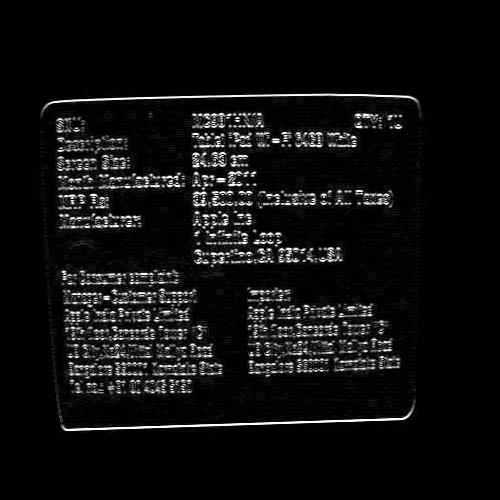

**img2bin.py**  
This script converts an input image file (`ocr_test_1.jpeg`) into a binary text representation (`input_image.txt`). This text file serves as the input for subsequent processing.  

 **prewitt-sum-app.v**  
Implements the Prewitt edge detection algorithm using a sum approximation to detect horizontal and vertical edges in the image. It takes the binary text file `input_image.txt` as input and outputs the edge-detected result to a file named `sumapp.txt`.  

**bound.v**  
Processes the edge-detected file `sumapp.txt` to identify sudden changes in pixel intensity ranges. It determines the contour with the largest area and generates a new file, `output_image.txt`. This file contains binary values (`0` and `255`) representing the largest bounding box detected.  

**bin2img.py**  
Converts the binary output (`output_image.txt`) into an image file (`output_image.jpg`). The resulting image has a white bounding box (representing the detected area) on a black background.  

**box-overlay.py**  
   Overlays the detected bounding box onto the original image.  
   - Takes `ocr_test_1.jpeg` (the original input image) and `output_image.jpg` (the binary image with the bounding box).  
   - Uses the values from `output_image.jpg` as the red channel, with green and blue channels set to `0`.  
   - The result is a red bounding box overlaid on the original image.  
   - Outputs the final overlaid image as `output_image_with_box.jpg`.  

| **Original Image**       | **After Vertical Prewitt** | **After Horizontal Prewitt** | **After Full Prewitt (Sum Approximation)** |
|---------------------------|----------------------------|------------------------------|--------------------------------------------|
|  |          |           |                    |

| **Original Image**       | **After Full Prewitt (Sum Approximation)** | **Binary Box** | **Overlayed Image with Box** |
|---------------------------|----------------------------|------------------------------|--------------------------------------------|
|  |         |           |                    |

| **Original Image**       | **After Full Prewitt (Sum Approximation)** | **Binary Box** | **Overlayed Image with Box** |
|---------------------------|----------------------------|------------------------------|--------------------------------------------|
|  |         |           |                    |
