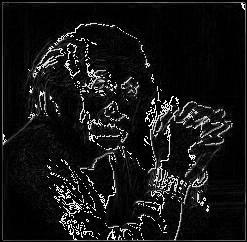
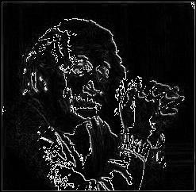
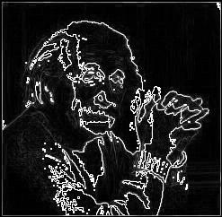
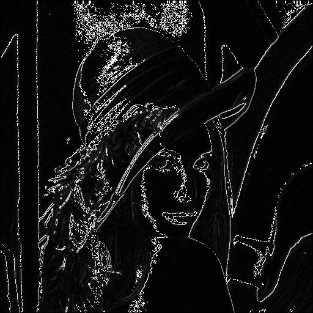
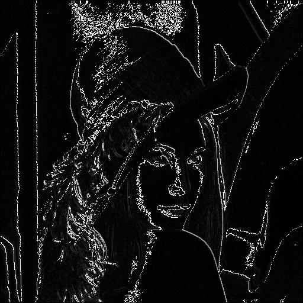
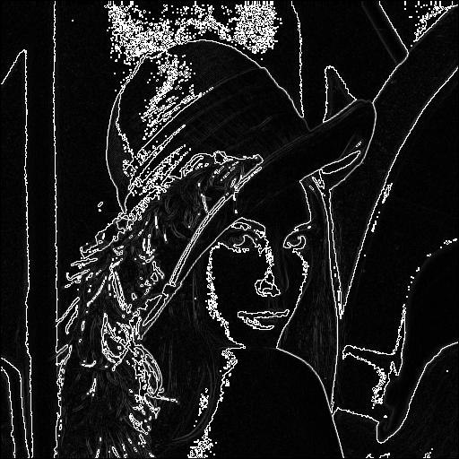

# Roberts Cross Edge Detection
The Roberts Cross operator is an edge detection technique used to detect areas of rapid intensity change in an image. It is one of the earliest edge detection methods and operates by calculating the gradient in diagonal directions. This operator highlights edges effectively by using simple 2x2 convolution kernels, making it computationally efficient and suitable for basic edge detection tasks.

## What is the Roberts Cross Operator?
The Roberts Cross operator is a gradient-based edge detection method designed to identify edges by computing the approximate gradient magnitude at each pixel. Unlike other operators like Sobel or Prewitt, which detect gradients in horizontal and vertical directions, the Roberts Cross operator focuses on diagonal gradients. Its simplicity makes it well-suited for applications that require minimal computational resources or where real-time performance is essential.

This operator works best on grayscale images and is typically used for applications like shape detection, feature extraction, and image segmentation in computer vision and digital image processing. Due to its small kernel size, the Roberts Cross operator is particularly useful for detecting fine details or high-frequency components in images.

Here’s the enhanced version of the Roberts Cross operator documentation with more mathematical expressions:

---

## Mathematical Definition  

### Gradient Masks  

The **Roberts Cross operator** is a discrete differentiation operator that computes the gradient of an image by approximating it along diagonal directions. It uses two 2x2 convolution kernels, $$\( G_x \)$$ and $$\( G_y \)$$, to compute gradients in the positive and negative diagonal directions, respectively.  

For the positive diagonal gradient $$\( G_x \)$$:  

$$
G_x = \begin{bmatrix}  
1 & 0 \\  
0 & -1  
\end{bmatrix}  
$$  

For the negative diagonal gradient $$\( G_y \)$$:  

$$
G_y = \begin{bmatrix}  
0 & 1 \\  
-1 & 0  
\end{bmatrix}  
$$  

### Discrete Gradient Approximation  

Let $$\( I(x, y) \)$$ denote the intensity of the pixel at coordinates $$\( (x, y) \)$$. The approximations to the gradients along the positive and negative diagonals are computed as:  

For $$\( G_x \)$$:  

$$
\partial_{x'} I(x, y) \approx (I(x, y) \cdot G_x[1,1]) + (I(x+1, y+1) \cdot G_x[2,2]) - (I(x, y+1) \cdot G_x[2,1]) - (I(x+1, y) \cdot G_x[1,2])  
$$  

For $$\( G_y \)$$:  

$$
\partial_{y'} I(x, y) \approx (I(x+1, y) \cdot G_y[2,1]) + (I(x, y+1) \cdot G_y[1,2]) - (I(x, y) \cdot G_y[1,1]) - (I(x+1, y+1) \cdot G_y[2,2])  
$$  

In compact notation, the convolutions can be expressed as:  

$$
(G_x * I)(x, y) = I(x, y) - I(x+1, y+1)  
$$  

$$
(G_y * I)(x, y) = I(x+1, y) - I(x, y+1)  
$$  

### Gradient Magnitude  

The gradient magnitude is computed by combining the contributions from both $$\( G_x \)$$ and $$\( G_y \)$$:  

$$
G(x, y) = \sqrt{\left(G_x(x, y)\right)^2 + \left(G_y(x, y)\right)^2}  
$$  

For computational simplicity, the magnitude can also be approximated as:  

$$
G(x, y) \approx |G_x(x, y)| + |G_y(x, y)|  
$$  

### Gradient Direction  

The gradient direction $$\( \theta(x, y) \)$$ is given by:  

$$
\theta(x, y) = \tan^{-1}\left(\frac{G_y(x, y)}{G_x(x, y)}\right)  
$$  

---

## Process of Edge Detection  

### 1. Convolution  

The Roberts Cross operator applies convolution to the image $$\( I(x, y) \)$$ using the two kernels $$\( G_x \)$$ and $$\( G_y \)$$. For each pixel $$\( (x, y) \)$$, the gradients are computed using the following:  

Positive diagonal:  

$$
\partial_{x'} I(x, y) = (I(x, y) - I(x+1, y+1))  
$$  

Negative diagonal:  

$$
\partial_{y'} I(x, y) = (I(x+1, y) - I(x, y+1))  
$$  

The convolutional result produces two gradient images corresponding to $$\( G_x \)$$ and $$\( G_y \)$$.  

---

### 2. Gradient Magnitude and Direction  

Using the computed gradients, the magnitude $$\( G(x, y) \)$$ is determined as:  

$$
G(x, y) = \sqrt{\left(G_x(x, y)\right)^2 + \left(G_y(x, y)\right)^2}  
$$  

Alternatively, the approximate magnitude is given by:  

$$
G(x, y) \approx |G_x(x, y)| + |G_y(x, y)|  
$$  

The gradient direction $$\( \theta(x, y) \)$$ is computed as:  

$$
\theta(x, y) = \tan^{-1}\left(\frac{G_y(x, y)}{G_x(x, y)}\right)  
$$  

---

### 3. Thresholding  

To extract edges, the gradient magnitude is thresholded to remove noise and weak edges. The thresholding operation is defined as:  

$$
E(x, y) =  
\begin{cases}  
1, & \text{if } G(x, y) \geq T \\  
0, & \text{otherwise}  
\end{cases}  
$$  

---

## Combined Roberts Cross Operator (Fixed Threshold)  

In the fixed threshold approach, the gradient magnitude is computed and capped at a maximum value of 255.  

1. **Magnitude Calculation**:  

$$
Edge_{strength} = \sqrt{G_x^2 + G_y^2}  
$$  

2. **Truncation**: Values exceeding 255 are set to 255.  

3. **Output**: A processed image based on truncated edge strengths.  

**Code Files:**  
- **roberts.v**: Verilog code for fixed thresholding.
- **combine.py**: Calculates edge strength for each pixel taking those 2 resultant text files after positive and negative operations. 
- **Output Files**:  
  - `output_image_combined.jpg`: The processed image.  
  - `output_image_combined.txt`: Binary data of the result.  


---

## Code Implementation

### Files and Functions

1. **combine.py** – This script processes both positive and negative mask images, finds the edge strength for each pixel, and generates the output images.
   - **Input**: `input_image.txt` (binary representation of the image)
   - **Output**: 
     - `output_image_pos_rc.jpg` (image with positive diagonal edges detected)
     - `output_image_neg_rc.jpg` (image with negative diagonal edges detected)
     - `output_image_combined.jpg` (combined result of both positive and negative edge detections)

2. **pos-roberts-kernel-kernel.txt** – Contains the positive mask for the Roberts Cross operator.
3. **neg-roberts-kernel-kernel.txt** – Contains the negative mask for the Roberts Cross operator.

### Process Flow

1. **Image Conversion to Binary**: 
   Convert the input image to a binary format for further processing.
   
   ```bash
   python img2bin.py input_image.jpg input_image.txt
   ```

2. **Apply Roberts Cross (Positive and Negative Masks)**:
   Run the convolution of the input image with the positive and negative masks to detect edges.

   - Positive Mask Application:
   ```bash
   python combine.py pos-roberts-kernel-kernel.txt input_image.txt output_image_pos_rc.jpg
   ```
   
   - Negative Mask Application:
   ```bash
   python combine.py neg-roberts-kernel-kernel.txt input_image.txt output_image_neg_rc.jpg
   ```

3. **Combine the Results**:
   Combine the positive and negative gradient images to create the final output.

   ```bash
   python combine.py combined input_image.txt output_image_combined.jpg
   ```

### Input and Output Files

- **Input Images**:
  - `input_image.jpg`: The original input image.
  
- **Output Images**:
  - `output_image_pos_rc.jpg`: Result after applying the positive Roberts Cross mask.
  - `output_image_neg_rc.jpg`: Result after applying the negative Roberts Cross mask.
  - `output_image_combined.jpg`: Final result after combining both positive and negative edge detections.

---

### Example Output Images

Here are the results from applying the Roberts Cross edge detection:

#### Positive Roberts Cross Edge Detection

 

#### Negative Roberts Cross Edge Detection

 

#### Combined Roberts Cross Edge Detection

 

### Visual Comparison of Edge Detection

The following table shows the comparison between the original and edge-detected images for the Lena image:

| Original Image          | Positive Mask Output  | Negative Mask Output  | Combined Output       |
|-------------------------|-----------------------|-----------------------|-----------------------|
|  |  |  |  |

---

## Implementation

This implementation uses Python 3.12.1 for image processing and combines it with the `combine.py` script to compute edge strength using Roberts Cross masks. 

- **combine.py** reads the text file representations of images and applies convolution using the positive and negative masks for edge detection.
- The resulting edge images are saved and visualized for analysis.

### Steps to Run

1. **Convert Image to Binary**:
   ```bash
   python img2bin.py input_image.jpg input_image.txt
   ```

2. **Apply Positive Roberts Cross**:
   ```bash
   python combine.py pos-roberts-kernel-kernel.txt input_image.txt output_image_pos_rc.jpg
   ```

3. **Apply Negative Roberts Cross**:
   ```bash
   python combine.py neg-roberts-kernel-kernel.txt input_image.txt output_image_neg_rc.jpg
   ```

4. **Combine Both Masks**:
   ```bash
   python combine.py combined input_image.txt output_image_combined.jpg
   ```

5. **View Results**: 
   After running the above steps, the edge-detected images can be viewed in their respective output files.

---

## Conclusion

Roberts Cross is a simple yet powerful edge detection technique that highlights diagonal edges in an image. By applying both positive and negative diagonal masks, you can detect edges in both directions and combine them for a complete edge map. This implementation offers an efficient way to extract edge features from images, useful in various computer vision tasks.
