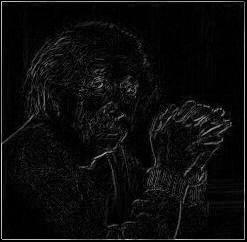
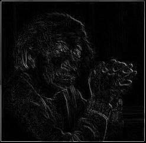
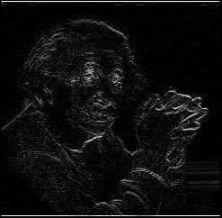

# Edge Detection with Roberts Cross Operator

| **Original**              | **Output Image (Positive Operator)** | **Output Image (Negative Operator)** | **Output Image (Combined RC Operator)** |
|---------------------------|--------------------------------------|--------------------------------------|-----------------------------------------|
|  |  |  |  |

