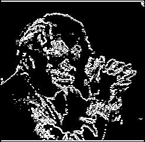
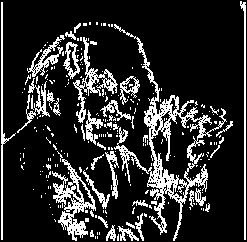
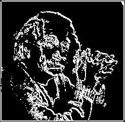
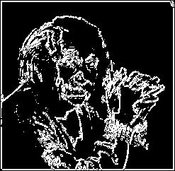

# Robinson Compass Edge Detection
The Robinson Compass is an edge detection technique that uses eight compass directions (North, South, East, West, Northwest, Northeast, Southwest, Southeast) to detect edges in an image. This method identifies directional changes in pixel intensity, which are indicative of edges. By convolving the image with kernels corresponding to these eight directions, the operator effectively highlights edges that align with any of these directions.

## What is the Robinson Compass Edge Detection?
The Robinson Compass edge detection method is a directionally sensitive approach that uses multiple kernels to detect edges along different orientations. Each of the eight compass directions corresponds to a distinct kernel that is convolved with the image. The result is a set of edge responses in each of these directions, allowing for precise detection of edges regardless of their orientation.

This operator is useful for detecting fine details and edges in images where the directionality of the edges is important. Unlike operators like Sobel or Prewitt, which detect edges based on gradients in horizontal and vertical directions, the Robinson Compass considers a broader range of orientations, providing more comprehensive edge detection.

The main goal of this method is to identify where there are significant transitions in pixel intensity across multiple orientations, which indicates the presence of edges. The method is especially valuable in applications where detecting edges in all possible directions is crucial, such as texture analysis, pattern recognition, and detailed image segmentation.

## Mathematical Definition  

### Kernels for the Robinson Compass  

The Robinson Compass operator uses eight directional kernels to detect edges in an image. These kernels are designed to approximate the gradient of an image in the following directions: **North (N)**, **South (S)**, **East (E)**, **West (W)**, **Northwest (NW)**, **Northeast (NE)**, **Southwest (SW)**, and **Southeast (SE)**.  

The kernels are as follows:  

**North (N):**  

$$
G_N =  
\begin{bmatrix}  
-1 & 0 & 1 \\  
-2 & 0 & 2 \\  
-1 & 0 & 1  
\end{bmatrix}  
$$  

**South (S):**  

$$
G_S =  
\begin{bmatrix}  
1 & 0 & -1 \\  
2 & 0 & -2 \\  
1 & 0 & -1  
\end{bmatrix}  
$$  

**East (E):**  

$$
G_E =  
\begin{bmatrix}  
1 & 2 & 1 \\  
0 & 0 & 0 \\  
-1 & -2 & -1  
\end{bmatrix}  
$$  

**West (W):**  

$$
G_W =  
\begin{bmatrix}  
-1 & -2 & -1 \\  
0 &  0 &  0 \\  
1 &  2 &  1  
\end{bmatrix}  
$$  

**Northwest (NW):**  

$$
G_{NW} =  
\begin{bmatrix}  
0 & 1 & 2 \\  
-1 & 0 & 1 \\  
-2 & -1 & 0  
\end{bmatrix}  
$$  

**Northeast (NE):**  

$$
G_{NE} =  
\begin{bmatrix}  
2 & 1 & 0 \\  
1 & 0 & -1 \\  
0 & -1 & -2  
\end{bmatrix}  
$$  

**Southwest (SW):**  

$$
G_{SW} =  
\begin{bmatrix}  
0 & -1 & -2 \\  
1 &  0 & -1 \\  
2 &  1 &  0  
\end{bmatrix}  
$$  

**Southeast (SE):**  

$$
G_{SE} =  
\begin{bmatrix}  
-2 & -1 &  0 \\  
-1 &  0 &  1 \\  
 0 &  1 &  2  
\end{bmatrix}  
$$  

### Gradient Approximation  

For each kernel $$\( G_d \)$$ (where $$\( d \in \{N, S, E, W, NW, NE, SW, SE\} \)$$), the gradient at pixel $$\( (x, y) \)$$ is computed as:  

$$
(G_d * I)(x, y) = \sum_{i=-1}^{1} \sum_{j=-1}^{1} G_d(i, j) \cdot I(x+i, y+j)  
$$  

Here:  
- $$\( I(x, y) \)$$ is the image intensity at pixel $$\( (x, y) \)$$.  
- $$\( G_d(i, j) \)$$ is the value of the kernel at position $$\( (i, j) \)$$.  

### Combined Gradient Magnitude  

After convolving the image with all eight kernels, the magnitude of the edge gradient can be calculated as the maximum response across all directions:  

$$
G(x, y) = \max \left( \left| G_N \right|, \left| G_S \right|, \left| G_E \right|, \left| G_W \right|, \left| G_{NW} \right|, \left| G_{NE} \right|, \left| G_{SW} \right|, \left| G_{SE} \right| \right)  
$$  

Alternatively, the gradient magnitude can be computed as a weighted sum of all directional gradients:  

$$
G(x, y) = \sqrt{\sum_{d} \left( G_d(x, y) \right)^2}  
$$  

where $$\( d \)$$ iterates over all directions.  

---

## Process of Edge Detection  

### Step 1: Convolution  

Each kernel is convolved with the image $$\( I(x, y) \)$$ to calculate the directional gradients. The convolution operation is expressed as:  

$$
(G_d * I)(x, y) = \sum_{i=-1}^{1} \sum_{j=-1}^{1} G_d(i, j) \cdot I(x+i, y+j)  
$$  

The result of this step is eight gradient images, one for each directional kernel.  

### Step 2: Gradient Magnitude Calculation  

The gradient magnitude at each pixel is calculated either by taking the maximum gradient magnitude across all directions:  

$$
G(x, y) = \max \left( \left| G_N \right|, \left| G_S \right|, \left| G_E \right|, \left| G_W \right|, \left| G_{NW} \right|, \left| G_{NE} \right|, \left| G_{SW} \right|, \left| G_{SE} \right| \right)  
$$  

Or by summing up the squared responses from all directions:  

$$
G(x, y) = \sqrt{\sum_{d} \left( G_d(x, y) \right)^2}  
$$  

### Step 3: Thresholding  

A threshold $$\( T \)$$ is applied to the gradient magnitude to detect edges. This is expressed as:  

$$
E(x, y) =  
\begin{cases}  
1, & \text{if } G(x, y) \geq T \\  
0, & \text{otherwise}  
\end{cases}  
$$  

---

## Implementation Details  

### Fixed Threshold  

In a fixed threshold approach, the edge magnitude is computed, and values above a predefined threshold are considered edges.  

**Code Files:**  
- **robinson.v**: Verilog code implementing convolution and fixed thresholding.  
- **Output Files:**  
  - `output_image_robinson.jpg`: Processed image with detected edges.  
  - `output_image_robinson.txt`: Raw binary edge data.  

### Dynamic Normalization  

Dynamic normalization adjusts the edge magnitude relative to the maximum gradient value in the image, ensuring that the output is scaled to a range of 0–255.  

**Normalization Formula:**  

$$
G_{\text{norm}}(x, y) = \frac{G(x, y)}{\max(G(x, y))} \times 255  
$$  

**Code Files:**  
- **robinson-dynamic.v**: Verilog code implementing convolution and dynamic normalization.  
- **Output Files:**  
  - `output_image_robinson_dynamic.jpg`: Dynamically normalized edge-detected image.  
  - `output_image_robinson_dynamic.txt`: Normalized binary data.  

---

### Output Files

For each direction, we generate the following files:

1. **Image Files**: The output images for each direction after applying the Robinson compass kernels:
   - `output_image_X_rc.jpg` where X represents the direction (n, s, e, w, nw, ne, se, sw).

2. **Text Files**: The binary data for each processed image:
   - `output_image_X_rc.txt`, which contains the raw binary data.

For each direction, the image and text files will be saved:

- `output_image_n_rc.jpg`
- `output_image_s_rc.jpg`
- `output_image_e_rc.jpg`
- `output_image_w_rc.jpg`
- `output_image_nw_rc.jpg`
- `output_image_ne_rc.jpg`
- `output_image_sw_rc.jpg`
- `output_image_se_rc.jpg`

---

### Example Execution for One Direction (e.g., East)

1. **Convolution**: The East kernel (E) is applied to the image, resulting in edge detection for that direction.

2. **Thresholding**: The image is thresholded at 127 to produce a binary edge map.

3. **Output**: The resulting binary image is saved as `output_image_e_rc.jpg`, and the binary values are saved in `output_image_e_rc.txt`.

---

### Visual Output

The results of applying the Robinson compass kernels to the image are shown below. Each kernel highlights edges in a specific direction:

- **East Direction (E)**:

 

- **South Direction (S)**:

 

- **West Direction (W)**:

 

- **North Direction (N)**:

 

- **Northwest Direction (NW)**:

 

- **Northeast Direction (NE)**:

 

- **Southwest Direction (SW)**:

 

- **Southeast Direction (SE)**:

 

---

### Binary Edge Detection (Threshold 127)

Additionally, the binary edge maps for each direction, after applying the 127 threshold to the gradient magnitudes, are provided. The file paths for each direction are as follows:

- **East Direction**: `output_image_e_rc.jpg`  
- **South Direction**: `output_image_s_rc.jpg`  
- **West Direction**: `output_image_w_rc.jpg`  
- **North Direction**: `output_image_n_rc.jpg`  
- **Northwest Direction**: `output_image_nw_rc.jpg`  
- **Northeast Direction**: `output_image_ne_rc.jpg`  
- **Southwest Direction**: `output_image_sw_rc.jpg`  
- **Southeast Direction**: `output_image_se_rc.jpg`

---

This implementation uses **Icarus Verilog 12.0** for hardware description and **Python 3.12.1** for image processing and visualization. The Verilog code performs the convolution of the Robinson compass kernels with the input image and calculates the edge strengths. Python handles the conversion between image formats, binary data handling, and visualization of the results.

### Execution Steps

1. **Convert Image to Binary** (img2bin.py)
2. **Apply Robinson Compass Kernels** using Verilog
3. **Thresholding and Magnitude Calculation** 
4. **Convert Binary Outputs to Images** (bin2img.py)

