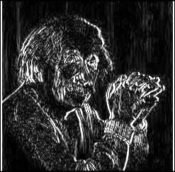
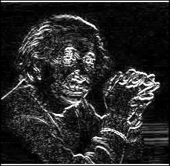
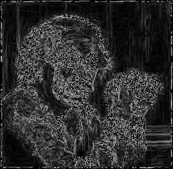
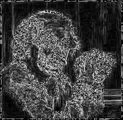
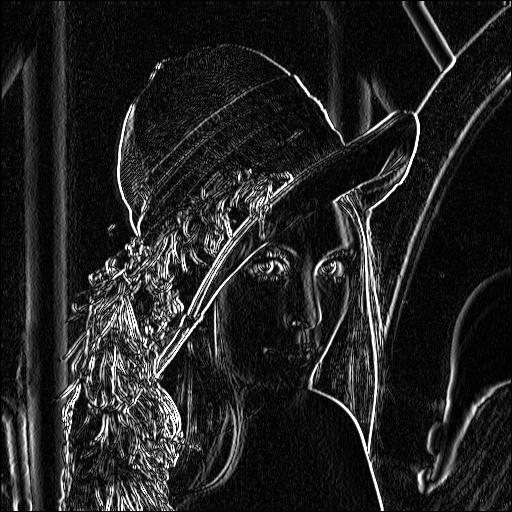
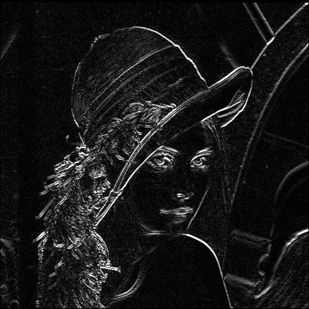
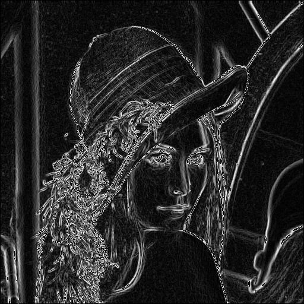
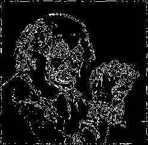

# Sobel Operator in Edge Detection
The Sobel operator is a discrete differentiation operator used in edge detection. Like the Prewitt operator, it computes the gradient in the horizontal and vertical directions by convolving an image with a pair of kernels. The Sobel operator, however, includes an additional weighting factor that gives more emphasis to the central pixels, resulting in smoother edges and better noise suppression.

## What is the Sobel Operator?
The Sobel operator is a gradient-based edge detection technique that highlights regions with significant intensity changes in an image. By calculating the gradient at each pixel, the Sobel operator identifies edges and boundaries that are crucial for understanding the structure of objects in an image. It is widely used in fields like computer vision, robotics, and image processing for tasks such as object detection, feature extraction, and segmentation.

What makes the Sobel operator unique is its use of weighted convolution masks, which prioritize the central pixels during gradient calculation. This results in better edge detection performance, especially in noisy environments, compared to simpler operators like Prewitt. The Sobel operator is particularly useful in applications where accuracy and noise resistance are important.

## Mathematical Definition

The Sobel operator uses two kernels to approximate the gradient of an image in the horizontal and vertical directions. The horizontal and vertical masks are defined as follows:

For the vertical mask, \( G_y \):

$$
G_y = \begin{bmatrix}
-1 & 0 & 1 \\
-2 & 0 & 2 \\
-1 & 0 & 1
\end{bmatrix}
$$

For the horizontal mask, \( G_x \):

$$
G_x = \begin{bmatrix}
-1 & -2 & -1 \\
 0 &  0 &  0 \\
 1 &  2 &  1
\end{bmatrix}
$$

Where:
- The vertical mask detects edges that are aligned vertically (up-down).
- The horizontal mask detects edges that are aligned horizontally (left-right).

## Process of Edge Detection

1. **Apply Convolution**: The Sobel operator is applied to the image by convolving the image with the masks. For each pixel in the image, the neighborhood around it is multiplied by the kernel, and the results are summed up. This results in two images: one for the vertical gradient (\( G_y \)) and one for the horizontal gradient (\( G_x \)).

2. **Magnitude Calculation**: The magnitude of the gradient at each pixel is computed by combining the results of the horizontal and vertical gradients:

$$
G = \sqrt{G_x^2 + G_y^2}
$$

3. **Thresholding**: To identify the edges, the magnitude is thresholded. Pixels with gradients above a certain threshold are considered part of the edge, while others are discarded.

---

## New Steps Added

### Combined Sobel Operator (Fixed Threshold)

In this approach, we combine the magnitudes from both the vertical and horizontal gradients to determine the edge strength at each pixel. The combined edge strength is then truncated to a maximum value of 255 (fixed-point threshold). This ensures that any values above 255 are capped.

1. **Magnitude Calculation**: The combined magnitude is calculated as:

$$
Edge_{strength} = \sqrt{G_x^2 + G_y^2}
$$

2. **Truncation**: If the calculated edge strength exceeds 255, it is set to 255.

3. **Output**: The final image is generated using the truncated edge strengths.

**Code Files:**
- **sobel.v**: This Verilog code calculates the combined edge strength and truncates values above 255.
- **Output Files**: 
  - `output_image_combined.jpg`: This is the resulting image after applying the combined Sobel operator and thresholding.
  - `output_image_combined.txt`: The raw binary data of the processed image.

---

### Dynamic Normalization

In this process, we normalize the edge strength by dividing each pixel’s edge strength by the maximum edge strength in the image and then scaling it to fit within the range of 0 to 255. This ensures that the maximum edge strength is 255.

1. **Edge Strength Normalization**: 

$$
Edge_{norm} = \frac{Edge_{strength}}{Max_{value}} \times 255
$$

2. **Output**: The final image is generated after normalizing the edge strengths.

**Code Files:**
- **sobel-dynamic.v**: This Verilog code calculates the edge strengths and applies dynamic normalization.
- **Output Files**:
  - `output_image_combined_dynamic.jpg`: The resulting image after applying dynamic normalization.
  - `output_image_combined_dynamic.txt`: The raw binary data of the normalized image.


---

## Implementation

This implementation is done using **Icarus Verilog 12.0** for the hardware description and **Python 3.12.1** for the image processing and visualization. 

- The Verilog code performs the convolution of the Sobel masks with the input image and calculates the combined edge strength.
- The Python code handles the image processing, including loading, applying the convolution, truncation, normalization, and visualizing the results.

### Code Flow

The following is a step-by-step breakdown of the process using different code files:

1. **img2bin.py** – Converts the input image (in `.jpg` format) into a binary `.txt` format for further processing. The input image should already be in black-and-white (BW); if not, it must be converted beforehand.
   - **Input**: `input_image.jpg`
   - **Output**: `input_image.txt`

2. **sobel-ver.v** – Implements the vertical Sobel operator. This Verilog file reads the binary image and applies the vertical Sobel mask.
   - **Input**: `input_image.txt`
   - **Output**: `output_image_ver.txt`

3. **sobel-hor.v** – Implements the horizontal Sobel operator. This Verilog file reads the binary image and applies the horizontal Sobel mask.
   - **Input**: `input_image.txt`
   - **Output**: `output_image_hor.txt`

4. **sobel.v** – Implements the combined Sobel operator, where the edge strength is calculated and truncated to 255.
   - **Input**: `input_image.txt`
   - **Output**: `output_image_combined.txt`

5. **sobel-dynamic.v** – Implements the dynamic normalization of edge strength.
   - **Input**: `input_image.txt`
   - **Output**: `output_image_combined_dynamic.txt`

6. **bin2img.py** – Converts the binary `.txt` files (output from the Verilog simulations) back into `.jpg` images.
   - **bin2img.py** – Converts `output_image_combined.txt` to `output_image_combined.jpg`.
   - **bin2img.py** – Converts `output_image_combined_dynamic.txt` to `output_image_combined_dynamic.jpg`.

### Execution Steps

The following steps are executed in sequence to complete the edge detection process:

1. **Convert Image to Binary (img2bin.py)**

   ```bash
   python .\img2bin.py
   ```

   Converts the input image (`input_image.jpg`) to the binary file format (`input_image.txt`).

2. **Vertical Sobel Operation (sobel-ver.v)**

   ```bash
   iverilog -o sobel-v .\sobel-ver.v
   vvp .\sobel-v
   ```

   The Verilog code (`sobel-ver.v`) is compiled using `iverilog` to create the executable `sobel-v`. The `vvp` command runs the simulation, generating `output_image_ver.txt`.

3. **Horizontal Sobel Operation (sobel-hor.v)**

   ```bash
   iverilog -o sobel-h .\sobel-hor.v
   vvp .\sobel-h
   ```

   The Verilog code (`sobel-hor.v`) is compiled to create the executable `sobel-h`. The `vvp` command generates `output_image_hor.txt`.

4. **Combined Sobel (sobel.v)**

   ```bash
   iverilog -o sobel .\sobel.v
   vvp .\sobel
   ```

   This Verilog code applies the combined Sobel operator and generates `output_image_combined.txt`.

5. **Dynamic Normalization (sobel-dynamic.v)**

   ```bash
   iverilog -o sobel-dynamic .\sobel-dynamic.v
   vvp .\sobel-dynamic
   ```

   This Verilog code applies dynamic normalization and generates `output_image_combined_dynamic.txt`.

6. **Convert Binary Outputs to Images**

   ```bash
   python .\bin2img.py
   ```

   Converts `output_image_combined.txt` and `output_image_combined_dynamic.txt` to `.jpg` images.

---

### Vertical Gradient Detection
The following images show the input image and the output image after applying the vertical Sobel mask.

 

### Horizontal Gradient Detection
The following images show the input image and the output image after applying the horizontal Sobel mask.

 

### Combined Sobel Edge Detection (Fixed Threshold)
The following image shows the input image and the output image after applying the combined Sobel operator with fixed threshold truncation.

 

### Dynamic Normalization of Edge Detection
The following image shows the input image and the output image after applying dynamic normalization to the combined Sobel operator.

 

<table>
  <tr>
    <td><b>Original Image</b></td>
   <td><b>Sobel Vertical</b></td>
   <td><b>Sobel Horizontal</b></td>
    <td><b>Dynamic Normalized Image</b></td>
  </tr>
  <tr>
    <td></td>
   <td></td>
   <td></td>
    <td></td>
  </tr>
</table>
### Binary Image with 127 Threshold

 


---

This implementation utilizes the following tools:

**Icarus Verilog 12.0** for hardware description and simulation. This tool is used to compile the Verilog code for the Sobel operator and perform edge detection in hardware simulation.

**Python 3.12.1** for image processing and visualization. Python handles the conversion between image formats, binary data handling, and applies the edge detection processing to visualize the results.
