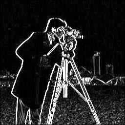
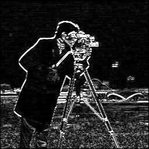
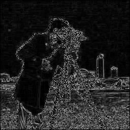
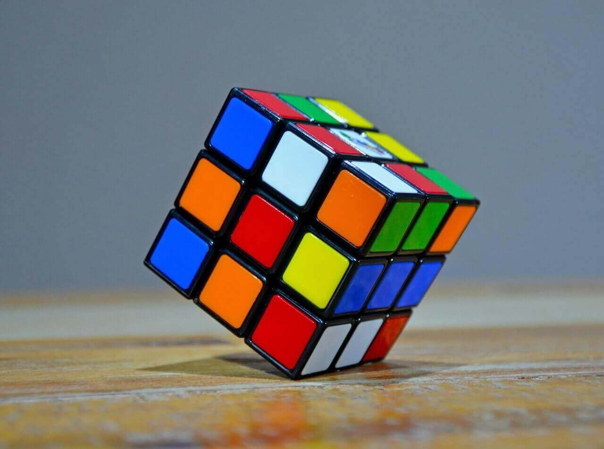
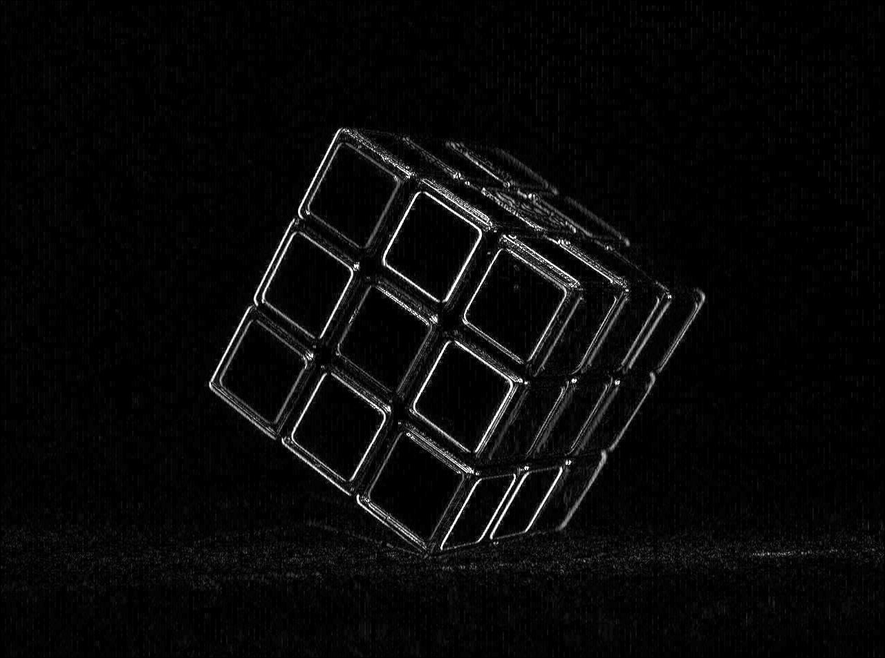
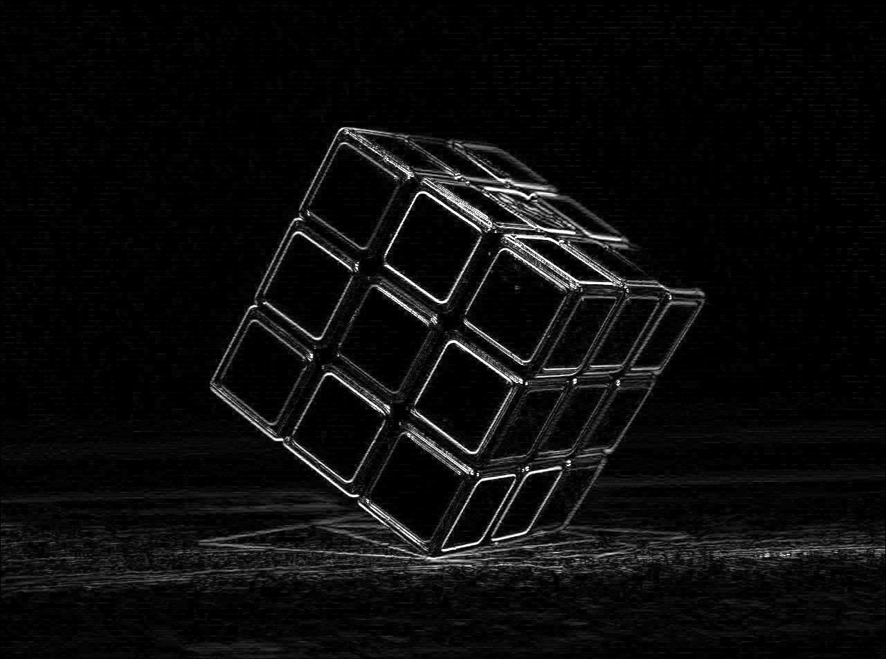
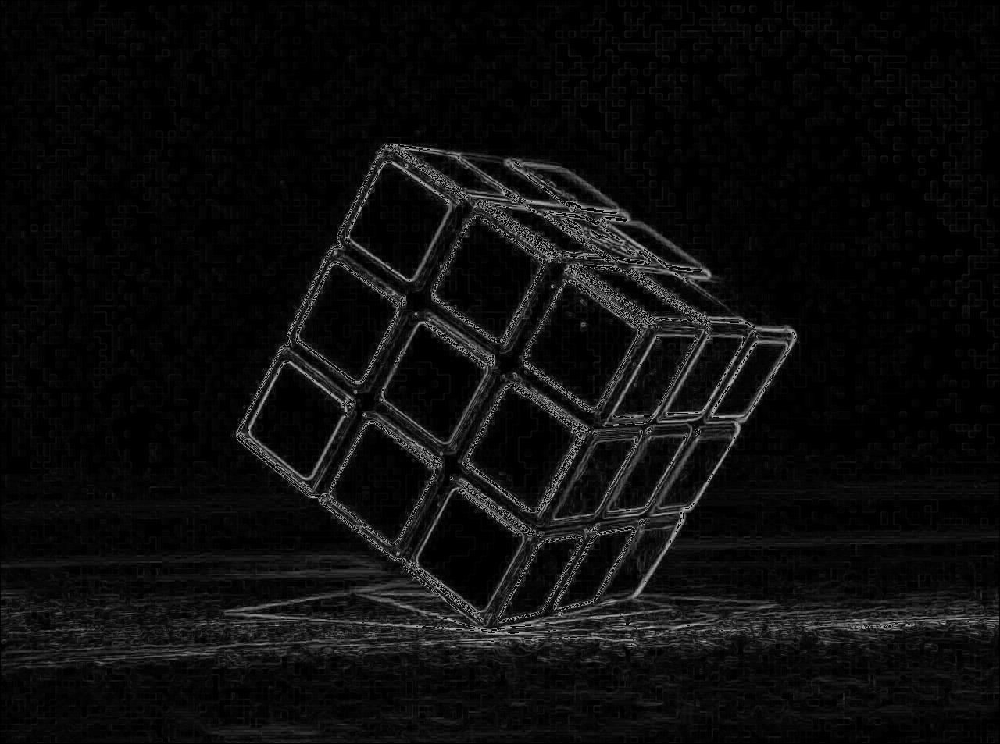

# Sobel Operator in Edge Detection
The Sobel operator is a discrete differentiation operator used in edge detection. Like the Prewitt operator, it computes the gradient in the horizontal and vertical directions by convolving an image with a pair of kernels. The Sobel operator, however, includes an additional weighting factor that gives more emphasis to the central pixels, resulting in smoother edges and better noise suppression.

## What is the Sobel Operator?
The Sobel operator is a gradient-based edge detection technique that highlights regions with significant intensity changes in an image. By calculating the gradient at each pixel, the Sobel operator identifies edges and boundaries that are crucial for understanding the structure of objects in an image. It is widely used in fields like computer vision, robotics, and image processing for tasks such as object detection, feature extraction, and segmentation.

What makes the Sobel operator unique is its use of weighted convolution masks, which prioritize the central pixels during gradient calculation. This results in better edge detection performance, especially in noisy environments, compared to simpler operators like Prewitt. The Sobel operator is particularly useful in applications where accuracy and noise resistance are important.


## Mathematical Definition  

### Gradient Masks  

The **Sobel operator** is mathematically defined as a discrete approximation to the partial derivatives of an image $$\( I(x, y) \)$$. It employs two convolution kernels, \( G_x \)$$ for the horizontal gradient and $$\( G_y \)$$ for the vertical gradient. These are represented as:  

For the vertical gradient $$\( G_y \)$$:  

$$
G_y = \begin{bmatrix}  
-1 & 0 & 1 \\  
-2 & 0 & 2 \\  
-1 & 0 & 1  
\end{bmatrix}  
$$  

For the horizontal gradient $$\( G_x \)$$:  

$$
G_x = \begin{bmatrix}  
-1 & -2 & -1 \\  
0 &  0 &  0 \\  
1 &  2 &  1  
\end{bmatrix}  
$$  

### Discrete Gradient Approximation  

Let $$\( I(x, y) \)$$ represent the image intensity at pixel coordinates $$\( (x, y) \)$$. The discrete approximations to the partial derivatives are computed as:  

$$
\partial_x I(x, y) \approx \sum_{i=-1}^{1} \sum_{j=-1}^{1} G_x(i, j) \cdot I(x+i, y+j)  
$$  

$$
\partial_y I(x, y) \approx \sum_{i=-1}^{1} \sum_{j=-1}^{1} G_y(i, j) \cdot I(x+i, y+j)  
$$  

Using a general summation over the image domain:  

$$
(G_x * I)(x, y) = \sum_{m=1}^{M} \sum_{n=1}^{N} G_x(m, n) \cdot I(x+m-2, y+n-2)  
$$  

$$
(G_y * I)(x, y) = \sum_{m=1}^{M} \sum_{n=1}^{N} G_y(m, n) \cdot I(x+m-2, y+n-2)  
$$  

where $$\( M \)$$ and $$\( N \)$$ are the dimensions of the kernels.  

### Gradient Magnitude  

The magnitude of the gradient at a pixel is computed as:  

$$
G(x, y) = \sqrt{\left(\partial_x I(x, y)\right)^2 + \left(\partial_y I(x, y)\right)^2}  
$$  

For computational efficiency, the gradient magnitude is often approximated as:  

$$
G(x, y) \approx |\partial_x I(x, y)| + |\partial_y I(x, y)|  
$$  

### Gradient Direction  

The direction of the gradient is given by:  

$$
\theta(x, y) = \tan^{-1}\left(\frac{\partial_y I(x, y)}{\partial_x I(x, y)}\right)  
$$  

---

## Process of Edge Detection  

### Convolution  

The edge detection process begins by convolving the image $$\( I(x, y) \)$$ with the Sobel kernels $$\( G_x \)$$ and $$\( G_y \)$$. Mathematically, this operation for each pixel $$\( (x, y) \)$$ is expressed as:  

Horizontal gradient:  

$$
(G_x * I)(x, y) = \sum_{i=-1}^{1} \sum_{j=-1}^{1} G_x(i, j) \cdot I(x+i, y+j)  
$$  

Vertical gradient:  

$$
(G_y * I)(x, y) = \sum_{i=-1}^{1} \sum_{j=-1}^{1} G_y(i, j) \cdot I(x+i, y+j)  
$$  

### Gradient Magnitude and Direction  

The gradients computed using the convolution operation are combined to form the gradient magnitude and direction. The magnitude at each pixel is:  

$$
G(x, y) = \sqrt{\left(\sum_{i=-1}^{1} \sum_{j=-1}^{1} G_x(i, j) \cdot I(x+i, y+j)\right)^2 + \left(\sum_{i=-1}^{1} \sum_{j=-1}^{1} G_y(i, j) \cdot I(x+i, y+j)\right)^2}  
$$  

The direction is similarly computed as:  

$$
\theta(x, y) = \tan^{-1}\left(\frac{\sum_{i=-1}^{1} \sum_{j=-1}^{1} G_y(i, j) \cdot I(x+i, y+j)}{\sum_{i=-1}^{1} \sum_{j=-1}^{1} G_x(i, j) \cdot I(x+i, y+j)}\right)  
$$  

### Thresholding  

Edges are identified by applying a threshold $$\( T \)$$ to the gradient magnitude. This is expressed as:  

$$
E(x, y) =  
\begin{cases}  
1, & \text{if } G(x, y) \geq T \\  
0, & \text{otherwise}  
\end{cases}  
$$  

### Combined Sobel Operator (Fixed Threshold)  

In this approach, the edge strength is computed by combining magnitudes from both gradients and truncating to a fixed maximum.  

1. **Magnitude Calculation**:  

$$
Edge_{strength} = \sqrt{G_x^2 + G_y^2}  
$$  

2. **Truncation**: Values exceeding 255 are capped.  

3. **Output**: A processed image using truncated edge strengths.  

**Code Files:**  
- **sobel.v**: Verilog code for fixed thresholding.  
- **Output Files**:  
  - `output_image_combined.jpg`: Processed image.  
  - `output_image_combined.txt`: Raw binary data.  

---

### Dynamic Normalization  

In this approach, edge strength is normalized relative to the maximum value, ensuring a full range of 0–255.  

1. **Normalization**:  

$$
Edge_{norm} = \frac{Edge_{strength}}{Max_{value}} \times 255  
$$  

2. **Output**: Final image with normalized edge strengths.  

**Code Files:**  
- **sobel-dynamic.v**: Verilog code for dynamic normalization.  
- **Output Files**:  
  - `output_image_combined_dynamic.jpg`: Normalized image.  
  - `output_image_combined_dynamic.txt`: Raw binary data.  


---

### Code Flow

The following is a step-by-step breakdown of the process using different code files:

1. **img2bin.py** – Converts the input image (in `.jpg` format) into a binary `.txt` format for further processing. The input image should already be in black-and-white (BW); if not, it must be converted beforehand.
   - **Input**: `input_image.jpg`
   - **Output**: `input_image.txt`

2. **sobel-ver.v** – Implements the vertical Sobel operator. This Verilog file reads the binary image and applies the vertical Sobel mask.
   - **Input**: `input_image.txt`
   - **Output**: `output_image_ver.txt`

3. **sobel-hor.v** – Implements the horizontal Sobel operator. This Verilog file reads the binary image and applies the horizontal Sobel mask.
   - **Input**: `input_image.txt`
   - **Output**: `output_image_hor.txt`

4. **sobel.v** – Implements the combined Sobel operator, where the edge strength is calculated and truncated to 255.
   - **Input**: `input_image.txt`
   - **Output**: `output_image_combined.txt`

5. **sobel-dynamic.v** – Implements the dynamic normalization of edge strength.
   - **Input**: `input_image.txt`
   - **Output**: `output_image_combined_dynamic.txt`

6. **bin2img.py** – Converts the binary `.txt` files (output from the Verilog simulations) back into `.jpg` images.
   - **bin2img.py** – Converts `output_image_combined.txt` to `output_image_combined.jpg`.
   - **bin2img.py** – Converts `output_image_combined_dynamic.txt` to `output_image_combined_dynamic.jpg`.

### Execution Steps

The following steps are executed in sequence to complete the edge detection process:

1. **Convert Image to Binary (img2bin.py)**

   ```bash
   python .\img2bin.py
   ```

   Converts the input image (`input_image.jpg`) to the binary file format (`input_image.txt`).

2. **Vertical Sobel Operation (sobel-ver.v)**

   ```bash
   iverilog -o sobel-v .\sobel-ver.v
   vvp .\sobel-v
   ```

   The Verilog code (`sobel-ver.v`) is compiled using `iverilog` to create the executable `sobel-v`. The `vvp` command runs the simulation, generating `output_image_ver.txt`.

3. **Horizontal Sobel Operation (sobel-hor.v)**

   ```bash
   iverilog -o sobel-h .\sobel-hor.v
   vvp .\sobel-h
   ```

   The Verilog code (`sobel-hor.v`) is compiled to create the executable `sobel-h`. The `vvp` command generates `output_image_hor.txt`.

4. **Combined Sobel (sobel.v)**

   ```bash
   iverilog -o sobel .\sobel.v
   vvp .\sobel
   ```

   This Verilog code applies the combined Sobel operator and generates `output_image_combined.txt`.

5. **Dynamic Normalization (sobel-dynamic.v)**

   ```bash
   iverilog -o sobel-dynamic .\sobel-dynamic.v
   vvp .\sobel-dynamic
   ```

   This Verilog code applies dynamic normalization and generates `output_image_combined_dynamic.txt`.

6. **Convert Binary Outputs to Images**

   ```bash
   python .\bin2img.py
   ```

   Converts `output_image_combined.txt` and `output_image_combined_dynamic.txt` to `.jpg` images.

---

### Vertical Gradient Detection
The following images show the input image and the output image after applying the vertical Sobel mask.

 

### Horizontal Gradient Detection
The following images show the input image and the output image after applying the horizontal Sobel mask.

 

### Combined Sobel Edge Detection (Fixed Threshold)
The following image shows the input image and the output image after applying the combined Sobel operator with fixed threshold truncation.

 

### Dynamic Normalization of Edge Detection
The following image shows the input image and the output image after applying dynamic normalization to the combined Sobel operator.

 

<table>
  <tr>
    <td><b>Original Image</b></td>
   <td><b>Sobel Vertical</b></td>
   <td><b>Sobel Horizontal</b></td>
    <td><b>Dynamic Normalized Image</b></td>
  </tr>
  <tr>
    <td></td>
   <td></td>
   <td></td>
    <td></td>
  </tr>
</table>

### Binary Image with 127 Threshold

 


---

## Implementation

This implementation is done using **Icarus Verilog 12.0** for the hardware description and **Python 3.12.1** for the image processing and visualization. 

**Icarus Verilog 12.0** for hardware description and simulation. This tool is used to compile the Verilog code for the Prewitt operator and perform edge detection in hardware simulation.

**Python 3.12.1** for image processing and visualization. Python handles the conversion between image formats, binary data handling, and applies the edge detection processing to visualize the results.


## More Images


| Original         | Vertical Gradient Detection | Horizontal Gradient Detection | Combined Prewitt Filter |
|------------------|-----------------------------|-------------------------------|--------------------------|
|  |  |  |  |
|  |  |  |  |
