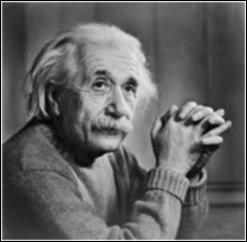

# Gaussian Blur  

This project demonstrates the application of a Gaussian blur to both grayscale and color images using Verilog. The Gaussian filter smooths an image by averaging the pixel values in a neighborhood defined by a Gaussian kernel. This effect reduces noise and detail, making the image appear blurred.  

---

## Workflow  

- **`img2bin.py`**: Converts the input image (`input_image.jpg` or `lily.jpg`) into a grayscale or RGB pixel data text file (`input_image.txt`).  
- **`guassian.v`**: Implements the Gaussian blur using a 3x3 kernel. It reads the pixel data from the input text file, applies the Gaussian filter, and outputs the blurred data to a text file.  
- **`bin2img.py`**: Converts the blurred pixel data back into an image file (e.g., `.jpg` or `.png`).  
- **`img2rgb.py`**: Extracts the RGB channels from the input image and converts them to individual grayscale images for each channel.  
- **`egb2img.py`**: Combines the RGB channels after Gaussian blur is applied to each to recreate the final color image.

---

## Mathematical Details  

### Gaussian Blur Filter  

The Gaussian blur filter is defined by a kernel that smooths the image based on a Gaussian function. For a 3x3 Gaussian filter, the kernel is typically represented as:

$$
G = \frac{1}{16} \begin{bmatrix} 
1 & 2 & 1 \\
2 & 4 & 2 \\
1 & 2 & 1 
\end{bmatrix}
$$

Where each value represents a weight for the corresponding pixel. The weights are chosen based on the Gaussian distribution, which is mathematically represented as:

$$
G(x, y) = \frac{1}{2\pi\sigma^2} e^{-\frac{x^2 + y^2}{2\sigma^2}}
$$

Where:
- \( \sigma \) is the standard deviation, controlling the amount of blur.
- \( x \) and \( y \) are the coordinates relative to the center of the kernel.

The resulting blurred pixel value \( B(i, j) \) at position \( (i, j) \) is calculated by taking a weighted sum of the surrounding pixels in the image, as given by:

$$
B(i, j) = \sum_{k=-1}^{1} \sum_{l=-1}^{1} I(i+k, j+l) G(k, l)
$$

Where:
- \( I(i, j) \) is the pixel value at position \( (i, j) \) in the input image.
- \( G(k, l) \) is the weight from the Gaussian kernel.

### Grayscale Gaussian Blur  

For grayscale images, the Gaussian blur is applied to the intensity value (luminance) of each pixel in the image.

### Color Image Gaussian Blur  

For color images, the Gaussian blur is applied independently to each of the three color channels (Red, Green, and Blue). After applying the blur to each channel, the channels are recombined to produce the final blurred image.

---

## Outputs  

### Grayscale Images  

The following table demonstrates the effects of Gaussian blur on a grayscale image:

| Input Image               | Blurred Image (3x3 Gaussian)       |  
|---------------------------|------------------------------------|  
|  |  |  

---

### Color Images  

The following table demonstrates the effects of Gaussian blur on a color image:

| Original Image             | Grayscale Image (Gaussian Blur)   | Final Blurred Image (RGB Gaussian Blur) |  
|---------------------------|------------------------------------|-----------------------------------------|  
|  |  |  |  
