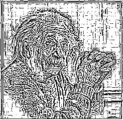
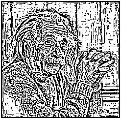
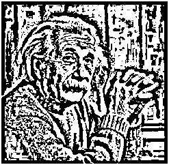

# Adaptive Thresholding

Adaptive thresholding is a technique in image processing used to convert a grayscale image into a binary image. Unlike global thresholding, which applies a single threshold value to all pixels, adaptive thresholding calculates the threshold for each pixel based on its local neighborhood.

## Mathematical Definition

The adaptive thresholding process can be mathematically defined as:

$$
I_{binary}(x, y) = \begin{cases}
    1, & \text{if } I_{grayscale}(x, y) > T_{local}(x, y) \\
    0, & \text{otherwise}
\end{cases}
$$

Where:
- $I_{binary}(x, y)$ is the pixel value in the binary output image.
- $I_{grayscale}(x, y)$ is the pixel value in the input grayscale image.
- $T_{local}(x, y)$ is the local threshold value, computed based on the pixel's neighborhood.

### Local Threshold Calculation

For a given pixel $$(x, y)$$, the local threshold $$T_{local}(x, y)$$ is determined by analyzing a surrounding $$n \times n$$ neighborhood matrix $$N(x, y)$$ centered at $$(x, y)$$. The two common methods for computing $$T_{local}(x, y)$$ are:

- **Mean Adaptive Thresholding:**

$$
T_{local}(x, y) = \frac{1}{n^2} \sum_{(i,j) \in N(x, y)} I_{grayscale}(i, j)
$$

- **Gaussian Adaptive Thresholding:**
 
$$
T_{local}(x, y) = \frac{1}{W} \sum_{(i,j) \in N(x, y)} G(i, j) \cdot I_{grayscale}(i, j)
$$

Where $$G(i, j)$$ represents a Gaussian weight, and $$W$$ is the sum of the weights.

Here, we have used **Mean Adaptive Thresholding**, where the local threshold is the average intensity of the pixels in the $n \times n$ neighborhood.

---

## Workflow

### Grayscale Images
- **`img2bin.py`**: Converts the input grayscale image (`input_image.jpg`) into a pixel data text file (`input_image.txt`).
- **`adaptive.v`**: Applies adaptive thresholding to all pixels from the text file (`input_image.txt`) using a specified $n \times n$ neighborhood and outputs the processed data (`output_image.txt`).
- **`bin2img.py`**: Converts the thresholded pixel data (`output_image.txt`) back into a grayscale image (`output_image.jpg`).

**Outputs:**
Grayscale image results for different window sizes:

| **Input Image**      | **3x3 Window**   | **5x5 Window**   | **10x10 Window**  |
|-----------------------|------------------|------------------|-------------------|
|  |  |  |  |

---

### Colored Images
- **`img2rgb.py`**: Splits the input colored image (`lena_org.png`) into three separate text files for the Red, Green, and Blue channels (`lena_r.txt`, `lena_g.txt`, `lena_b.txt`).
- **`adaptive.v`**: Applies adaptive thresholding to each channel separately using different neighborhood sizes (e.g., R:3x3, G:4x4, B:5x5). Outputs processed text files (`lena_adap_r.txt`, `lena_adap_g.txt`, `lena_adap_b.txt`).
- **`rgb2img.py`**: Combines the processed text files for the three channels into a single image (`lena_adap.jpg`).

**Outputs:**
For a colored image processed with adaptive thresholds using neighborhood sizes R:3x3, G:4x4, B:5x5:

| **Input Image**      | **Output Image R:3x3, G:4x4, B:5x5**  |
|-----------------------|-------------------|
|  |  |

