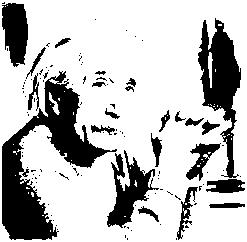
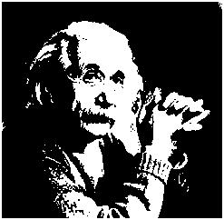
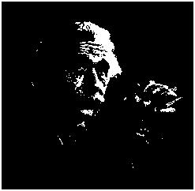

# Global Thresholding

Global thresholding is a technique used in image processing to convert a grayscale image into a binary image by applying a single threshold value to all pixels. The threshold determines whether a pixel becomes black (0) or white (1) in the binary output.

## Mathematical Definition
The global thresholding process can be mathematically defined as:

$$
I_{binary}(x, y) = \begin{cases} 
    1, & \text{if } I_{grayscale}(x, y) > T \\
    0, & \text{otherwise}
\end{cases}
$$

Where:
- $I_{binary}(x, y)$ is the pixel value in the binary output image.
- $I_{grayscale}(x, y)$ is the pixel value in the input grayscale image.
- $T$ is the global threshold value.

---

## Workflow

### Grayscale Images
- **`img2bin.py`**: Converts the input grayscale image (`input_image.jpg`) into a pixel data text file (`input_image.txt`).  
- **`global.v`**: Applies a global threshold to all pixels from the text file (`input_image.txt`) using the specified threshold value and outputs the processed data (`output_image.txt`).
- **`bin2img.py`**: Converts the thresholded pixel data (`output_image.txt`) back into a grayscale image (`output_image.jpg`).

**Outputs:**
Grayscale image results for different thresholds:

| **Input Image**      | **64thr**       | **128thr**       | **192thr**       |
|-----------------------|-----------------|------------------|------------------|
|  |  |  |  |

---

### Colored Images
- **`img2rgb.py`**: Splits the input colored image (`lena_org.png`) into three separate text files for the Red, Green, and Blue channels (`lena_r.txt`, `lena_g.txt`, `lena_b.txt`).
- **`global.v`**: Applies global thresholding to each channel separately, using the specified thresholds (e.g., R:64, G:128, B:192). Outputs processed text files (`lena_64r.txt`, `lena_128g.txt`, `lena_192b.txt`).
- **`rgb2img.py`**: Combines the processed text files for the three channels into a single image (`lena_global.jpg`).

**Outputs:**
For a colored image processed with thresholds R:64, G:128, B:192:

| **Input Image**      | **Output Image R:64, G:128, B:192** |
|-----------------------|------------------------|
|  |  |

