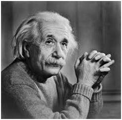

# Otsu's Method for Thresholding

Otsu's method is an adaptive thresholding technique used in image processing to determine an optimal threshold value for converting a grayscale image into a binary image. Unlike global thresholding, Otsu's method computes the threshold automatically based on image statistics by minimizing the intra-class variance.

## Mathematical Definition

Otsu's method aims to separate an image into two classes: foreground and background. The algorithm finds the threshold $$\( T \)$$ that minimizes the weighted sum of variances of the two classes.

### Objective Function
The threshold $$\( T \)$$ is chosen such that the intra-class variance $$\( \sigma_w^2 \)$$ is minimized:

$$
\sigma_w^2(T) = \omega_0(T) \sigma_0^2(T) + \omega_1(T) \sigma_1^2(T)
$$

Where:

$$\( \omega_0 \)$$ and $$\( \omega_1 \)$$ are the probabilities (weights) of the two classes separated by the threshold $$\( T \)$$.
$$\( \sigma_0^2 \)$$ and $$\( \sigma_1^2 \)$$ are the variances of the two classes.

The probabilities $$\( \omega_0 \)$$ and $$\( \omega_1 \)$$ are defined as:

$$
\omega_0(T) = \sum_{i=0}^T p(i), \quad \omega_1(T) = \sum_{i=T+1}^{L-1} p(i)
$$

The class means $$\( \mu_0 \)$$ and $$\( \mu_1 \)$$ are given by:

$$
\mu_0(T) = \frac{\sum_{i=0}^T i \, p(i)}{\omega_0(T)}, \quad \mu_1(T) = \frac{\sum_{i=T+1}^{L-1} i \, p(i)}{\omega_1(T)}
$$

The between-class variance $$\( \sigma_b^2 \)$$, which Otsu maximizes, is:

$$
\sigma_b^2(T) = \omega_0(T) \omega_1(T) \left[ \mu_1(T) - \mu_0(T) \right]^2
$$

---

## Workflow

### Grayscale Images
- **`img2bin.py`**: Converts the input grayscale image (`input_image.jpg`) into a pixel data text file (`input_image.txt`).
- **`otsu.v`**: Implements Otsu's algorithm to calculate the optimal threshold \( T \) and apply it to all pixels from the text file, generating the processed binary data (`otsu_output.txt`).
- **`bin2img.py`**: Converts the thresholded pixel data (`otsu_output.txt`) back into a binary image (`otsu.jpg`).

**Outputs:**

| **Input Image**      | **Otsu's Binary Image** |
|-----------------------|-------------------------|
|  |  |

### Histogram and Threshold for Grayscale Image

The threshold $$\( T \)$$ is marked on the histogram:

$$
T = \arg \min_T \left[ \sigma_w^2(T) \right]
$$

| Input Image Histogram | Output Image Histogram -- 123 threshold|
|-------------------------------|-----------------------------|
|  |  |

---

### Colored Images
- **`img2rgb.py`**: Splits the input colored image (`lena_org.png`) into three separate text files for the Red, Green, and Blue channels (`lena_r.txt`, `lena_g.txt`, `lena_b.txt`).
- **`otsu.v`**: Applies Otsu's method to each channel independently to compute thresholds for the Red, Green, and Blue channels. Outputs processed binary text files (`lena_otsu_r.txt`, `lena_otsu_g.txt`, `lena_otsu_b.txt`).
- **`rgb2img.py`**: Combines the processed binary files for the three channels into a single binary color image (`lena_otsu.jpg`).

**Outputs:**

| **Input Image**      | **Otsu's Binary Image (R, G, B)** |
|-----------------------|-----------------------------|
|  |  |

## Calculated Thresholds

The optimal thresholds calculated using Otsu's method for the input images are:

| **Image**            | **Calculated Threshold**         |
|-----------------------|----------------------------------|
| **input_image.jpg**   | 123                            |
| **lena_org.png**      | R: 161, G: 101, B: 112         |
