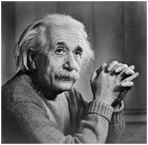
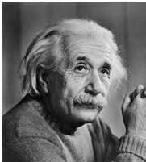
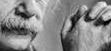
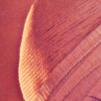

# Image Cropping

This project demonstrates image cropping for grayscale images using Verilog. The cropping process extracts a rectangular region from the input image defined by specified coordinates, creating a new image containing only the selected area.

---

## Workflow

- **`img2bin.py`**: Converts the input image (`input_image.jpg`) into a grayscale pixel data text file (`input_image.txt`).
- **`crop.v`**: Reads the pixel data from the input text file, extracts the region defined by the cropping coordinates (`CROP_X1`, `CROP_Y1`, `CROP_X2`, `CROP_Y2`), and outputs the cropped pixel data to a text file.
- **`bin2img.py`**: Converts the cropped pixel data back into an image file (e.g., `.jpg` or `.png`).

---

## Mathematical Details

### Image Cropping

Image cropping involves extracting a rectangular region from the input image defined by the top-left coordinates $$\( (\text{CROP}_X1, \text{CROP}_Y1) \)$$ and the bottom-right coordinates $$\( (\text{CROP}_X2, \text{CROP}_Y2) \)$$. The dimensions of the cropped region are given by:

$$
\text{Cropped Rows} = \text{CROP}_Y2 - \text{CROP}_Y1 + 1
\text{Cropped Columns} = \text{CROP}_X2 - \text{CROP}_X1 + 1
$$

For each pixel in the cropped region, the pixel value in the original image at coordinates $$\( (i, j) \)$$ is assigned to the corresponding position in the cropped image:

$$
P_{\text{cropped}}(i, j) = P_{\text{original}}(\text{CROP}_Y1 + i, \text{CROP}_X1 + j)
$$

---

### Boundary Conditions

The cropping coordinates must satisfy the following conditions to ensure the cropped region lies entirely within the bounds of the original image:

$$
0 \leq \text{CROP}_X1 < \text{CROP}_X2 < \text{COLS}, \quad 0 \leq \text{CROP}_Y1 < \text{CROP}_Y2 < \text{ROWS}
$$

Pixels outside the defined cropping area are excluded, and the resulting image contains only the selected region.

---

## Outputs

### Grayscale Images

The following table demonstrates the effects of cropping an image using different coordinates:

| Input Image               | Cropped Image (0, 0 to 180, 200)   | Cropped Image (90, 100 to 200, 150)  |
|---------------------------|-----------------------------------------|---------------------------------------|
|  |  |  |

---

### Colored Images

For colored images, the cropping process is applied independently to the red, green, and blue channels and then combined to produce the final image.

| Original Image           | Cropped Image (100, 100 to 200, 200)   |
|---------------------------|-----------------------------------------|
|  |  |

---

