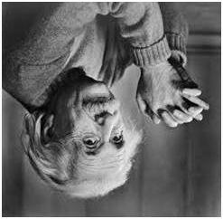
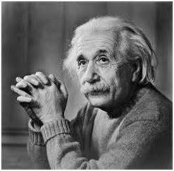
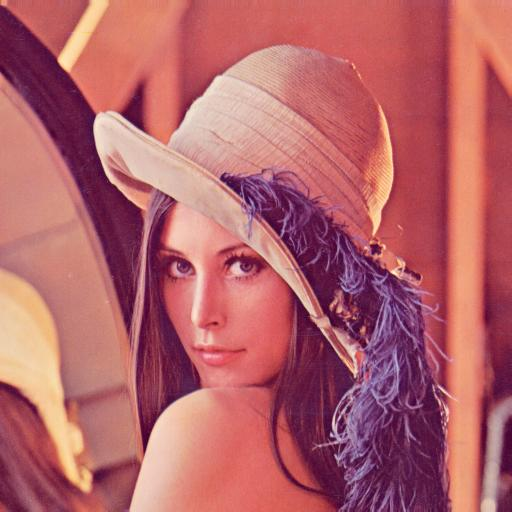

# Image Reflection  

This project demonstrates image reflection for grayscale and color images using Verilog. The reflection process mirrors the image along the vertical or horizontal axes based on a specified parameter.  

---

## Workflow  

- **`img2bin.py`**: Converts the input image (`input_image.jpg` or `kena_org.png`) into a grayscale or RGB pixel data text file (`input_image.txt`).  
- **`reflect.v`**: Reads the pixel data from the input text file, applies reflection transformations based on the specified axes (`AXES`), and outputs the reflected data to a text file.  
  - **AXES = 01**: Vertical reflection (mirrors the image along the vertical axis).  
  - **AXES = 10**: Horizontal reflection (mirrors the image along the horizontal axis).  
- **`bin2img.py`**: Converts the reflected pixel data back into an image file (e.g., `.jpg` or `.png`).  

---

## Mathematical Details  

### Image Reflection  

Image reflection involves flipping the pixel positions along either the vertical or horizontal axis.  

- **Vertical Reflection (AXES = 01):**  
  For an image of dimensions ROWS × COLS, each pixel in the original image at position $$\( (i, j) \)$$ is reflected to position $$\( (i, j') \)$$, where:
  
$$
j' = \text{COLS} - 1 - j
$$  

- **Horizontal Reflection (AXES = 10):**  
  Each pixel at position $$\( (i, j) \)$$ is reflected to position $$\( (i', j) \)$$, where:
  
$$
i' = \text{ROWS} - 1 - i
$$  

---

### Color Image Reflection  

For color images, the reflection is applied independently to the red, green, and blue channels. The reflected channels are then combined to produce the final image.  

---

## Outputs  

### Grayscale Images  

The following table demonstrates the effects of vertical and horizontal reflection on a grayscale image:  

| Input Image               | Vertically Reflected Image        | Horizontally Reflected Image       |  
|---------------------------|------------------------------------|------------------------------------|  
|  |  |  |  

---

### Color Images  

The following table demonstrates the effects of vertical and horizontal reflection on a color image:  

| Original Image           | Vertically Reflected Image        | Horizontally Reflected Image       |  
|---------------------------|------------------------------------|------------------------------------|  
|  |  |  |  

