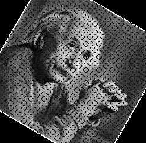
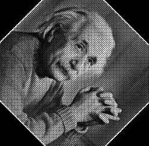
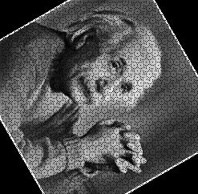
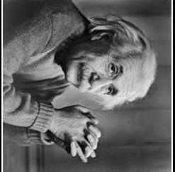
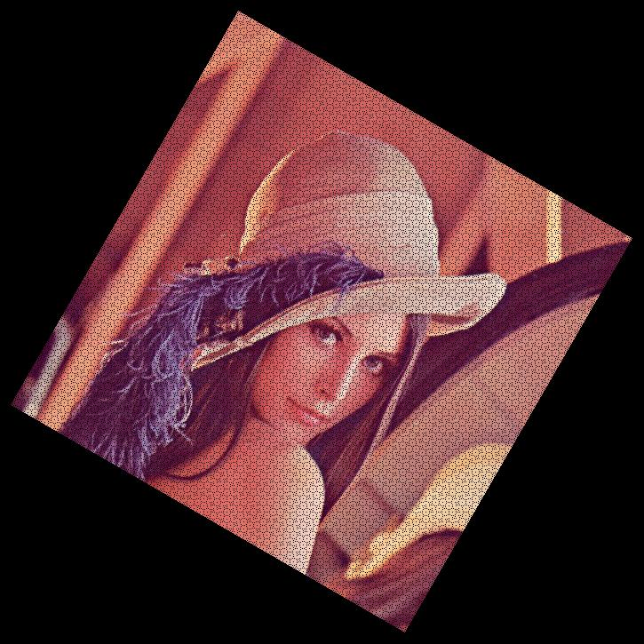

# Image Rotation  

This project demonstrates image rotation by a specified angle using Verilog. The process involves translating pixel coordinates to the image center, applying a geometric rotation matrix, and handling pixel shifting and boundary conditions to generate the rotated image.  

## Workflow  

- **`img2bin.py`**: Converts the input image (`input_image.jpg`) into a black-and-white pixel data text file (`input_image.txt`).  
- **`rotate.v`**: Accepts the pixel data from `input_image.txt`, applies a rotation transformation using the rotation matrix, and outputs the transformed data to `output_image.txt`.  
- **`bin2img.py`**: Converts the rotated pixel data from `output_image.txt` back into an image (`output_image.jpg`).  

---

## Mathematical Details  

### Translate Pixel Coordinates to Image Center  

To perform a rotation around the center of the image, the pixel coordinates $$(j, i)$$ are first translated by shifting the origin to the image center. The shifted coordinates $$(x_{\text{shifted}}, y_{\text{shifted}})$$ are given by:  

$$
x_{\text{shifted}} = j - \text{center}_x
$$  

$$
y_{\text{shifted}} = i - \text{center}_y
$$  

The center of the image is computed using the image dimensions:  

$$
\text{center}_x = \frac{\text{COLS} - 1}{2}, \quad \text{center}_y = \frac{\text{ROWS} - 1}{2}
$$  

### Apply the Rotation Matrix  

The pixel coordinates are then transformed using the 2D rotation matrix. The rotation matrix $$R(\theta)$$ for a given angle $$\theta$$ is defined as:  

$$
R(\theta) = 
\begin{bmatrix}
\cos(\theta) & \sin(\theta) \\
-\sin(\theta) & \cos(\theta)
\end{bmatrix}
$$  

The original pixel coordinates $$(x_{\text{shifted}}, y_{\text{shifted}})$$ are represented as the vector $$P$$:  

$$
P = 
\begin{bmatrix}
x_{\text{shifted}} \\
y_{\text{shifted}}
\end{bmatrix}
$$  

The rotated pixel coordinates $$P' = (x', y')$$ are computed by multiplying the rotation matrix $$R(\theta)$$ with the original coordinates:  

$$
P' = R(\theta) \cdot P
$$  

Breaking this down into the components for the rotated coordinates:  

$$
x_{\text{rotated}} = x_{\text{shifted}} \cdot \cos(\theta) - y_{\text{shifted}} \cdot \sin(\theta)
$$  

$$
y_{\text{rotated}} = x_{\text{shifted}} \cdot \sin(\theta) + y_{\text{shifted}} \cdot \cos(\theta)
$$  

### Translate Back to Original Image Coordinates  

Once the rotation is applied, the pixel coordinates are translated back to the original image space by shifting the origin back to the image center:  

$$
j' = \text{round}(x_{\text{rotated}} + \text{center}_x)
$$  

$$
i' = \text{round}(y_{\text{rotated}} + \text{center}_y)
$$  

### Check Bounds  

After calculating the new coordinates $$(i', j')$$, it's essential to ensure that they lie within the image boundaries. The pixel is discarded or set to zero if the new coordinates are out of bounds:  

$$
0 \leq i' < \text{ROWS}, \quad 0 \leq j' < \text{COLS}
$$  

---

## Outputs  

The following results show the visual effects of rotating the input image by various angles. Below are the original and rotated images, demonstrating different rotation transformations:

| Original Image           | 30° Rotated Image          | 45° Rotated Image          | 60° Rotated Image          | 90° Rotated Image          |  
|---------------------------|----------------------------|----------------------------|----------------------------|----------------------------|  
|  |  |  |  |  |  

---

For coloured images:

- **`img2rgb.py`**: Converts the input image (`lena_org.png`) into three separate text files representing the pixel values for the red, green, and blue channels.
- **`rotate.v`**: Rotates all three channel data (red, green, and blue) by the same angle and outputs the transformed pixel values into corresponding text files.
- **`rotate-full.v`**: Outputs full image taking diagonal as height and width.
- **`rgb2img.py`**: Combines the rotated red, green, and blue channel data into a single image (`lena_rot.jpg`).

| Original Image           | 30° Rotated Image          | 30° Rotated Image  Full     |  
|---------------------------|----------------------------|----------------------------|
|  |  |  |

