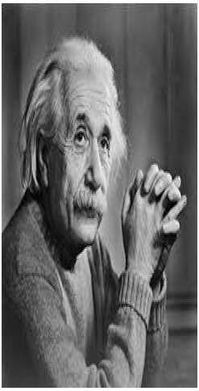
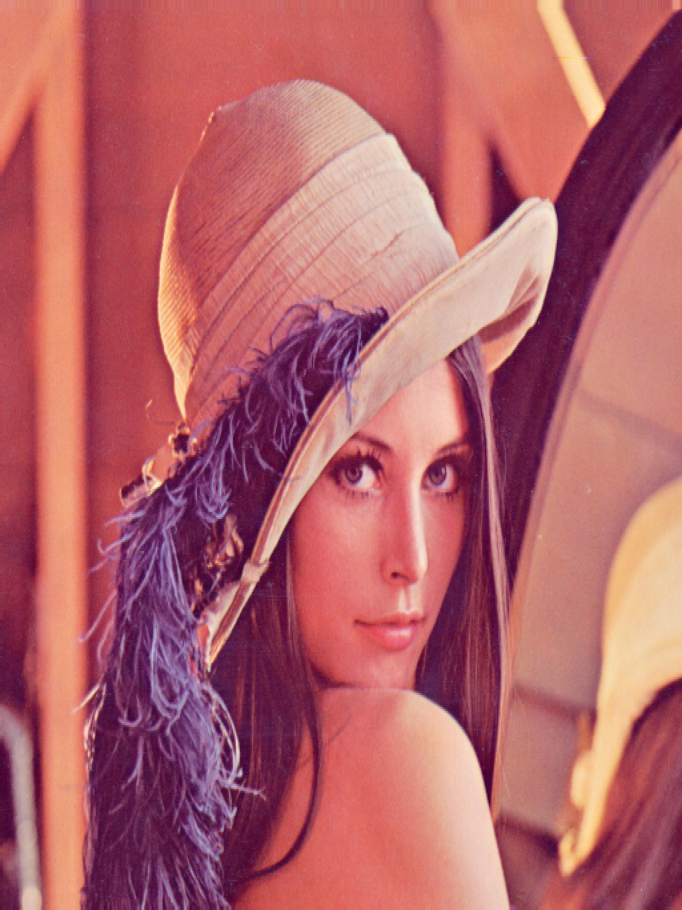

# Image Scaling/Resizing  

This project demonstrates image scaling and resizing for both grayscale and colored images using Verilog. The scaling process adjusts the image dimensions based on specified vertical (M) and horizontal (N) scaling factors.  

## Workflow  

- **`img2bin.py`**: Converts the input image (`input_image.jpg`) into a grayscale pixel data text file (`input_image.txt`) or three separate text files for the red, green, and blue channels for colored images.  
- **`scale.v`**: Reads the pixel data from the input text file(s), applies scaling transformations using the specified M (vertical) and N (horizontal) scaling factors, and outputs the scaled data to text file(s).  
- **`bin2img.py`**: Converts the scaled pixel data back into an image file (e.g., `.jpg` or `.png`).  

---

## Mathematical Details  

### Image Dimensions  

Given the original image dimensions: 

$$
\[
\text{Original Rows} = \text{ROWS}, \quad \text{Original Columns} = \text{COLS},
\] 
$$

the dimensions of the scaled image are calculated as:  

$$
\[
\text{New Rows} = \text{ROWS} \cdot M, \quad \text{New Columns} = \text{COLS} \cdot N,
\]  
$$

where $$\( M \)$$ and $$\( N \)$$ are the vertical and horizontal scaling factors, respectively.

### Scaling Transformation  

For each pixel in the scaled image at position $$\( (i, j) \)$$, its corresponding coordinates $$\( (i', j') \)$$ in the original image are computed as:  

$$
\[
i' = \left\lfloor \frac{i}{M} \right\rfloor, \quad j' = \left\lfloor \frac{j}{N} \right\rfloor.
\] 
$$

Here, the floor operation $$(\(\lfloor x \rfloor\))$$ ensures that the computed coordinates map to integer indices in the original image.

### Bounds Check  

To avoid accessing pixels outside the bounds of the original image, the coordinates $$\( (i', j') \)$$ must satisfy:  

$$
\[
0 \leq i' < \text{ROWS}, \quad 0 \leq j' < \text{COLS}.
\]  
$$

If the condition is met, the pixel value in the original image at coordinates $$\((i', j')\)$$ is assigned to the corresponding position $$\((i, j)\)$$ in the scaled image.  

The pixel value assignment can be expressed as follows:  

For the scaled image:

$$
P_\text{scaled}(i, j)
$$

and for the original image:

$$
P_\text{original}(i', j'),
$$

the relationship is:

$$
P_\text{scaled}(i, j) = P_\text{original}(i', j').
$$

### Nearest-Neighbor Interpolation  

Nearest-neighbor interpolation selects the closest pixel in the original image to approximate the value of a pixel in the scaled image. The algorithm essentially "stretches" or "shrinks" the original image by duplicating or discarding pixel values.
  

---

## Outputs  

### Grayscale Images  

The following table demonstrates the effects of scaling with different vertical (M) and horizontal (N) factors:  

| Input Image               | 2H1V Scaled Image          | 2V1H Scaled Image          | 2H2V Scaled Image          |  
|---------------------------|----------------------------|----------------------------|----------------------------|  
|  |  |  |  |  

---

### Colored Images  

For colored images, the scaling process is applied independently to the red, green, and blue channels and then combined to produce the final image.  

| Original Image           | 4V3H Scaled Image          |  
|---------------------------|----------------------------|  
|  |  |  

