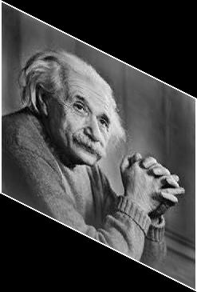
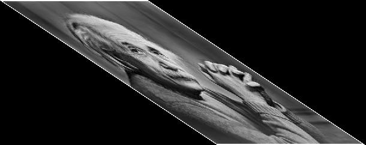
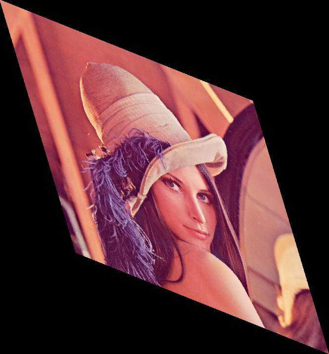

# Image Shearing

This project demonstrates image shearing for both grayscale and colored images using Verilog. Image shearing distorts the image by shifting pixel positions based on specified horizontal and vertical shearing factors ($$\(S_x\)$$ and $$\(S_y\)$$).

## Workflow

- **`img2bin.py`**: Converts the input image (`input_image.jpg`) into a grayscale pixel data text file (`input_image.txt`) or three separate text files for the red, green, and blue channels for colored images.  
- **`shear.v`**: Reads the pixel data from the input text file(s), applies shearing transformations using the specified $$\(S_x\)$$ (horizontal) and $$\(S_y\)$$ (vertical) shearing factors, and outputs the sheared data to text file(s).  
- **`bin2img.py`**: Converts the sheared pixel data back into an image file (e.g., `.jpg` or `.png`).  

---

## Mathematical Details

### Shearing Transformation

The shearing transformation equations are:

$$
\[
x_\text{new} = x + S_x \cdot y, \quad y_\text{new} = y + S_y \cdot x
\]
$$

In the code, these are implemented as:

$$
\[
\text{sheared\_i} = y + S_y \cdot x, \quad \text{sheared\_j} = x + S_x \cdot y
\]
$$

Here, `sheared_i` and `sheared_j` are the new pixel positions in the sheared image, corresponding to $$y_\text{new}$$ and $$x_\text{new}$$, respectively.  

### Coordinate Mapping and Precision

The shearing factors $$\(S_x\)$$ and $$\(S_y\)$$ are floating-point values. During calculation, the pixel coordinates are truncated to integers to match the pixel grid, using Verilog's `$rtoi()` function.

### New Image Dimensions

The dimensions of the sheared image are calculated as:

$$
\[
\text{NewRows} = \text{Rows} + \lceil |S_y| \cdot \text{Cols} \rceil, \quad \text{NewCols} = \text{Cols} + \lceil |S_x| \cdot \text{Rows} \rceil
\]
$$

Here, the ceiling function is applied because Verilog's `$rtoi()` truncates fractional values to integers, ensuring the new dimensions accommodate the maximum displacement due to shearing.

### Pixel Mapping

For each pixel at position $$\( (x, y) \)$$ in the original image, the sheared position $$\( (x_\text{new}, y_\text{new}) \)$$ is computed based on the shearing factors. The corresponding pixel value is then assigned:

$$
P_\text{sheared}(x_\text{new}, y_\text{new}) = P_\text{original}(x, y).
$$

### Bounds Check

To ensure the sheared image remains within valid dimensions, the new coordinates $$\( x' \)$$ and $$\( y' \)$$ must satisfy:

$$
\[
0 \leq x' < \text{NewCols}
\]
$$

and  

$$
\[
0 \leq y' < \text{NewRows}.
\]
$$

### Padding

The sheared image is padded with zeros to ensure that the dimensions remain uniform. In the code, this is done by initializing all pixels in the output image array (`sheared_pixel_data`) to zero before performing the shearing transformation.

### Maximum Dimensions

To accommodate images with large shearing factors, the output array is defined with a maximum size of $$2048 \times 2048$$. For larger images, adjust this size accordingly by modifying the array dimensions in the Verilog code.

---

## Outputs

### Grayscale Images

The following table demonstrates the effects of shearing with different horizontal ($$\(S_x\)$$) and vertical ($$\(S_y\)$$) shearing factors:

| Input Image               | $$S_x = 0, S_y = 0.5$$    | $$S_x = 1.5, S_y = 0$$      | $$S_x = 0.3, S_y = 0.4$$    |  
|---------------------------|----------------------------|-----------------------------|-----------------------------|  
|  |  |  |  |  

### Colored Images

For colored images, the shearing process is applied independently to the red, green, and blue channels and then combined to produce the final image.

| Original Image           | Sheared Image ($$\(S_x = 0.5, S_y = 0.5\)$$) |  
|---------------------------|---------------------------------------------|  
|  |          |  

---

**Note:**

For supporting a Lena image of size **512x512**, modify the array size in the Verilog code as follows:

```verilog
reg [7:0] sheared_pixel_data [0:717][0:666];
```

