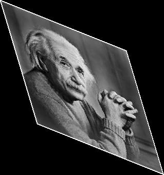

# Image Shearing  

This project demonstrates image shearing for both grayscale and colored images using Verilog. Image shearing distorts the image by shifting pixel positions based on specified horizontal and vertical shearing factors ($$\(S_x\)$$ and $$\(S_y\)$$).  

## Workflow  

- **`img2bin.py`**: Converts the input image (`input_image.jpg`) into a grayscale pixel data text file (`input_image.txt`) or three separate text files for the red, green, and blue channels for colored images.  
- **`shear.v`**: Reads the pixel data from the input text file(s), applies shearing transformations using the specified $$\(S_x\)$$ (horizontal) and $$\(S_y\)$$ (vertical) shearing factors, and outputs the sheared data to text file(s).  
- **`bin2img.py`**: Converts the sheared pixel data back into an image file (e.g., `.jpg` or `.png`).  

---

## Mathematical Details  

### Shearing Transformation  

Shearing shifts the pixel positions in a way that the image appears slanted. This transformation is applied using the following formula:  

$$
\[
x_\text{new} = x + S_x \cdot y, \quad y_\text{new} = y + S_y \cdot x,
\]  
$$

where $$\(S_x\)$$ and $$\(S_y\)$$ are the horizontal and vertical shearing factors, respectively.  

### Pixel Mapping  

For each pixel at position $$\( (x, y) \)$$ in the original image, the sheared position $$\( (x_\text{new}, y_\text{new}) \)$$ is computed based on the shearing factors. The corresponding pixel value is then assigned:  

$$
P_\text{sheared}(x_\text{new}, y_\text{new}) = P_\text{original}(x, y).
$$  


### Bounds Check  

To ensure the sheared image remains within valid dimensions, the new coordinates $$\( x' \)$$ and $$\( y' \)$$ must satisfy:  

$$
\[
0 \leq x' < \text{NewCols}
\]
$$

and  

$$
\[
0 \leq y' < \text{NewRows}.
\]
$$

The new image dimensions, accounting for the maximum displacement due to shearing, are:  

$$
\[
\text{NewRows} = \text{Rows} + |S_x| \cdot \text{Cols}
\]
$$

and  

$$
\[
\text{NewCols} = \text{Cols} + |S_y| \cdot \text{Rows}.
\]
$$

### Padding  

If necessary, the sheared image is padded with zeros (black pixels) to maintain uniform dimensions.  

---

## Outputs  

### Grayscale Images  

The following table demonstrates the effects of shearing with different horizontal ($$\(S_x\)$$) and vertical ($$\(S_y\)$$) shearing factors:  

| Input Image               | $$S_x = 0, S_y = 0.5$$    | $$S_x = 1.5, S_y = 0$$      | $$S_x = 0.3, S_y = 0.4$$    |  
|---------------------------|----------------------------|-----------------------------|-----------------------------|  
|  |  |  |  |  

---

### Colored Images  

For colored images, the shearing process is applied independently to the red, green, and blue channels and then combined to produce the final image.  

| Original Image           | Sheared Image ($$\(S_x = 0.5, S_y = 0.5\)$$) |  
|---------------------------|---------------------------------------------|  
|  |          |  

---

**Note:**  

For supporting a Lena image of size **512x512**, modify line 12 in `shear.v` as follows:  

```verilog
reg [7:0] sheared_pixel_data [0:2047][0:2047];
```  

This change ensures support for a maximum of **2048 pixels** on either side, which accounts for large shearing factors applied to a **512x512** image. 


