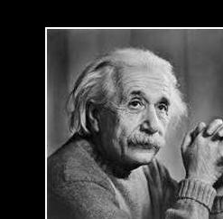
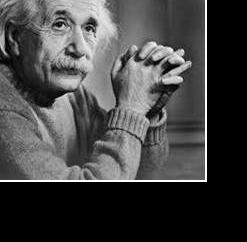
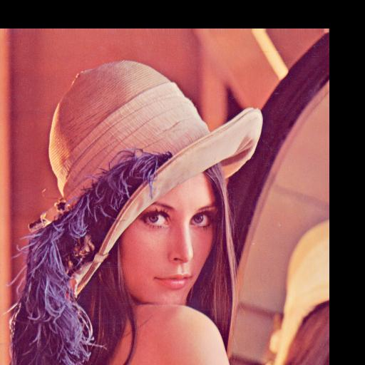

# Image Translation  

This project demonstrates image translation for grayscale images using Verilog. The translation process shifts the position of pixels horizontally and vertically by specified amounts, ensuring the translated pixels remain within the image bounds.  

## Workflow  

- **`img2bin.py`**: Converts the input image (`input_image.jpg`) into a grayscale pixel data text file (`input_image.txt`).  
- **`translate.v`**: Reads the pixel data from the input text file, applies translation transformations using specified horizontal (`TRANSLATE_X`) and vertical (`TRANSLATE_Y`) translation amounts, and outputs the translated data to a text file.  
- **`bin2img.py`**: Converts the translated pixel data back into an image file (e.g., `.jpg` or `.png`).  

---

## Mathematical Details  

### Image Translation  

Image translation shifts all pixels by a fixed amount in the horizontal and vertical directions, specified by parameters $$\( \text{TRANSLATE}_X \)$$ and $$\( \text{TRANSLATE}_X \)$$.  

For each pixel in the original image at position $$\( (i, j) \)$$, the corresponding coordinates $$\( (i', j') \)$$ in the translated image are computed as:  

$$
i' = i + \text{TRANSLATE}_X
$$  
 
$$
j' = j + \text{TRANSLATE}_Y
$$  

### Bounds Check  

To ensure the translated coordinates $$\( (i', j') \)$$ remain within the image dimensions, they must satisfy the following conditions:  

$$
\[
0 \leq i' < \text{ROWS}, \quad 0 \leq j' < \text{COLS}.
\] 
$$ 

If the conditions are satisfied, the pixel value in the original image at coordinates $$\( (i, j) \)$$ is assigned to the new position $$\( (i', j') \)$$ in the translated image. Pixels that do not fall within the bounds of the translated image are set to black (value 0).  

The pixel value assignment is expressed as:  

$$
\[
P_{\text{translated}}(i', j') = P_{\text{original}}(i, j).
\]  
$$

## Outputs  

### Grayscale Images  

The following table demonstrates the effects of translating an image using different horizontal and vertical translation amounts:  

| Input Image               | Translated Image (X: 50, Y: 30)   | Translated Image (X: -40, Y: -60)  |  
|---------------------------|-------------------------------------|------------------------------------|  
|  |  |  |  

---

### Colored Images  

For colored images, the scaling process is applied independently to the red, green, and blue channels and then combined to produce the final image.  

| Original Image           | Translated Image (X: -50, Y: 40)   |  
|---------------------------|----------------------------|  
|  |  |  

---
